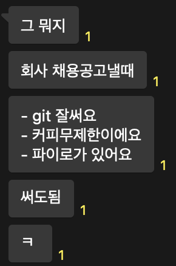

# [Dreamfora](https://dreamfora.com/)

- 기간: 2021.08 -

## 회사 기여도

### git 과 GitHub 도입

- 형상관리 도입
  - git 과 GitHub 관련 교육을 3개월 동안 진행
- 코드 리뷰 문화 도입
  - 모바일 팀에 코드 리뷰를 해주기 위해
- 이슈관리 도입

[도입한 이후, 동료의 후기](https://dvlv.tistory.com/130?category=935817)

### 멀티 모듈 도입

### 테스트 작성 문화 도입

안드로이드 팀에 도입을 위해 nextstep 에서 다음 2가지 과정을 수강했습니다.

- 이펙티브 코틀린 with TDD, Refactoring, Clean Code 3기
- 안드로이드 아키텍처 with TDD 2기

테스트 주도까지는 아니어도 테스트로 가능하다는 것을 보여주었습니다.
