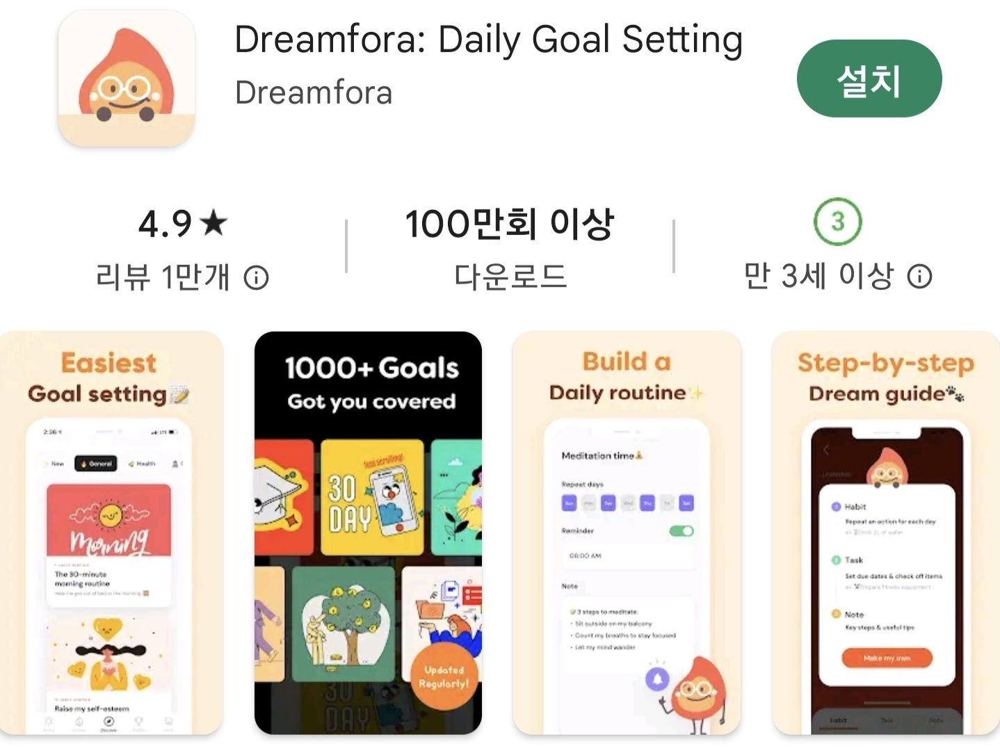
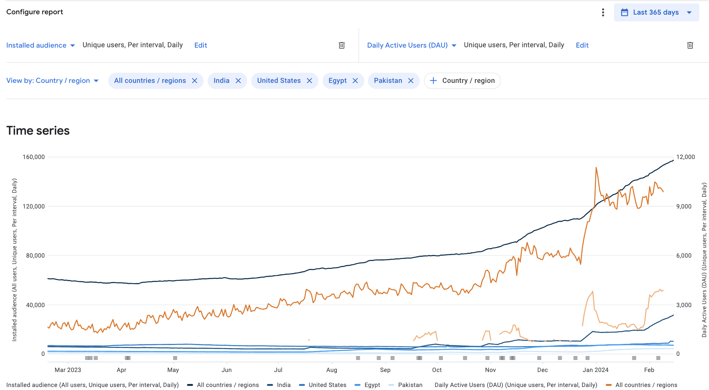
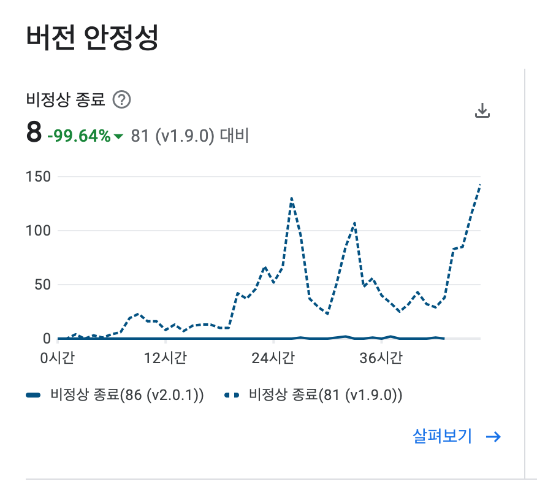
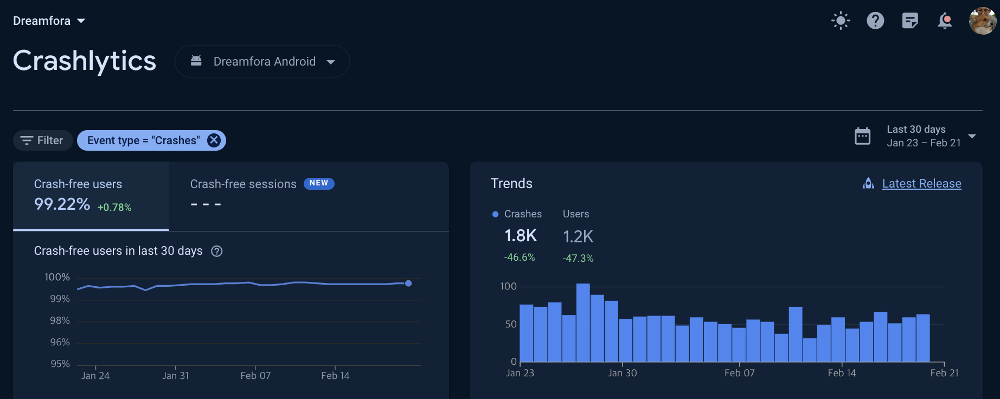
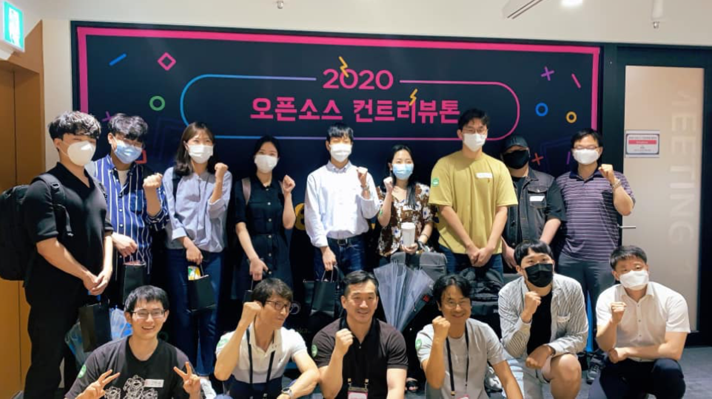
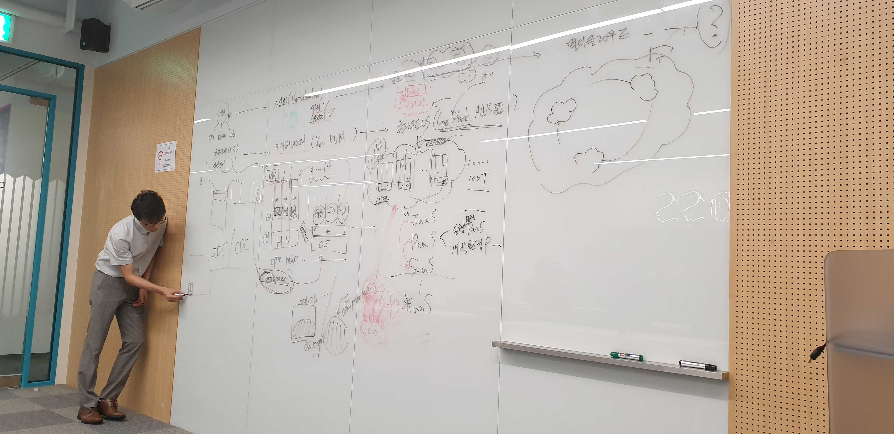
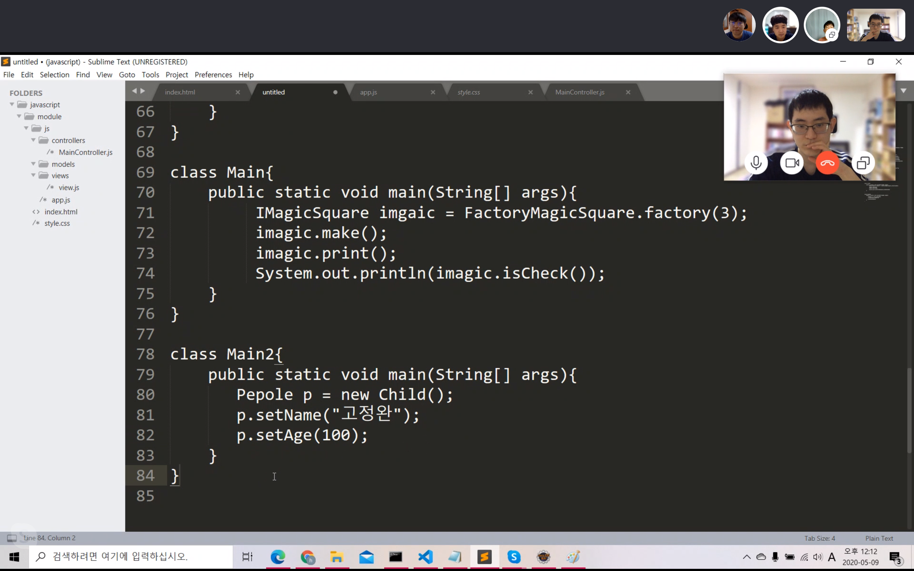

# 고정완의 이력서

## 경력

- [Dreamfora](https://play.google.com/store/apps/details?id=com.dreamfora.dreamfora): 2021.8.25 -
  - Java, Spring Boot, Spring Security, JPA, MariaDB
  - 200만 사용자를 확보한 목표관리 서비스를 개발 및 유지보수 했습니다.
- [Ecube Labs](https://www.ecubelabs.com): 2018.10.15 - 2020.12.28
  - TypeScript, React, Redux, Express.js
  - 미국에 서비스하는 스마트 시티 솔루션을 개발 및 유지보수 했습니다.
- [NECSST](https://next.cs.vt.edu) 인턴: 2018.06.04 - 2018.09.21
  - InfiniBand 환경에서의 RDMA 를 활용한 Aggregated Data Center 연구에 참여했습니다.

## 교육

- [우아한테크코스](https://www.woowacourse.io) 리뷰어: 2024.02.13 - 2024.06.24
- [NEXTSTEP JPA](https://edu.nextstep.camp/c/UHESCzBt) 리뷰어: 2023.10.14 - 2023.11.25
- [NEXTSTEP Spring](https://edu.nextstep.camp/c/4YUvqn9V) 리뷰어: 2022.07.18 - 2022.09.29
- [NEXTSTEP Java TDD](https://edu.nextstep.camp/c/8fWRxNWU) 리뷰어: 2021.03 - 2021.05
- [한빛미디어 공감주니어](http://www.hanbit.co.kr/store/education/edu_view.html?p_code=S3414110334) 강사: 2019.03 - 2019.06

## 학력

- [과학기술원 컴퓨터공학](https://cse.unist.ac.kr) 성적 우수 졸업
  - 알고리즘 A+, 데이터구조 A, 데이터베이스 A-, 운영체제 A-, 네트워크 A-
- 코드스쿼드 백엔드 마스터즈 수료

## 보유기술

|&nbsp;&nbsp;&nbsp;&nbsp;&nbsp;&nbsp;&nbsp;&nbsp;&nbsp;&nbsp;&nbsp;&nbsp;&nbsp;&nbsp;&nbsp;&nbsp;&nbsp;&nbsp;&nbsp;|&nbsp;&nbsp;&nbsp;&nbsp;&nbsp;&nbsp;&nbsp;&nbsp;&nbsp;&nbsp;&nbsp;&nbsp;&nbsp;&nbsp;&nbsp;&nbsp;&nbsp;&nbsp;&nbsp;&nbsp;&nbsp;&nbsp;&nbsp;&nbsp;&nbsp;&nbsp;&nbsp;&nbsp;&nbsp;&nbsp;&nbsp;&nbsp;&nbsp;&nbsp;&nbsp;||
|--|--|--|
|언어|`Java` `Kotlin`   `Typescript`|**리플렉션**을 통해 커스텀 어노테이션을 만든 경험과,   **코루틴**을 활용한 병렬 상태관리 경험이 있습니다.|
|프레임워크|`Spring` `JPA`   `Spring Security`   `React` `Android`|JPA 를 사용한 경험을 바탕으로,   안드로이드에서 **영속성 컨텍스트**를 직접 구현했습니다.|
|DB|`MySQL` `SQLite`|InnoDB 와 다른 **스토리지 엔진**의 락이 어떻게 다르게 걸리는지 이해하고 있습니다.   테이블 단위로 락이 걸리는 SQLite 의 트랜잭션에 반응하기 위해, **리액티브 프로그래밍**을 도입하여 렌더링 최적화를 해낸 경험이 있습니다.|
|인프라|`Docker` `EC2`   `IAM` `S3` `RDS`   `CloutFront`   `Route53`|Docker 가 어떻게 독립된 **cgroup** 과 **namespace** 를 가지는지 프로세스 생성 과정을 추적한 경험이 있습니다.   DB 를 private network 에 분리해야하는 필요성을 인지하고 있으며, **Bastion Host** 에 대해 알고 있습니다. IAM 에서 **Role** 을 통해 필요한 권한을 부여하는 법에 대해 알고 있습니다.|

## 자신있는 코드

- Java
  - [Hibernate 를 바닐라 Java 로 흉내](https://github.com/ghojeong/jpa-association)
  - [IoC 컨테이너를 바닐라 Java 로 구현](https://github.com/ghojeong/playground/tree/main/dependency/src/main/java/ioc)
  - [Typesafe Heterogeneous Container](https://github.com/ghojeong/Effective-Java-Study/blob/main/pyro/item33.md)
  - [WAS 를 TDD로 구현](https://github.com/ghojeong/jwp-was)
- Javascript
  - [비동기](https://github.com/ghojeong/resume/blob/master/code/js/runTasks.js)
  - [redux-observable](https://github.com/ghojeong/resume/blob/master/code/README.md)

# Dreamfora

- 200만 다운로드
- [미국 앱스토어 피쳐드](https://apps.apple.com/us/story/id1681928254)

## 이미지 중개 서버 구현

- 기간: 2024.01 - 2024.02
- 설명
  - CloudFlare 뿐만 아니라 S3 를 활용한 다른 이미지 서버를 염두해두고 중개하는 서버를 구현했습니다.
  - 기존의 이미지 업로드 인터페이스 규약을 유지하여 클라이언트 수정이 없도록 하였습니다.

## 배치 서버 구현

- 기간: 2023.09 - 2023.12
- 설명
  - 테스트 주도로 개발 가능한 배치 서버 구현했습니다.
  - 배치로 정기적으로 Dream 복사 숫자 집계 기능 구현했습니다.
  - 배치로 정기적인 api_log 백업을 구현하여, 로그를 가격이 싼 S3 스토리지로 옮겼습니다.

## 쿼리 튜닝, 객체 및 DB 모델 리팩토링, 인프라 재구축

- 기간: 2023.04 - 2023.08
- 설명
  - N + 1 쿼리가 발생하는 JPA 레포지토리를 전부 찾아내서 리팩토링했습니다.
  - JOIN 하는 테이블 갯수가 4개 이하가 되도록 DB 스키마를 전부 새롭게 모델링했습니다.
  - 새롭게 모델링한 스키마에 오래된 스키마의 데이터를 마이그레이션했습니다.
  - 최적화한 DB 와 WAS 에 필요한 성능에 맞추어 인프라를 재구축 했습니다.
  - 실서비스에 영향이 가지 않도록 dev, stage, production 의 인프라를 나누어야 한다고 경영진을 설득해냈습니다.
  - production 인프라는 DB 의 망분리를 진행하여, public IP 가 할당되지 않도록 했습니다.
  - 슬로우 쿼리를 모니터링할 수 있는 인프라를 구축했습니다.
  - API request, response, duration 을 기록하는 로깅 시스템을 구축했습니다.
  - 로깅 시스템으로 인해 스토리지가 꽉 차면 로그를 지우는 배치서버를 구현했습니다.
  - 리팩토링과 최적화 덕분에 인프라 비용이 월 **216만원에서 73만원** 으로 줄었습니다.
  - 전부 혼자했습니다.

## ATDD 도입, 세션 기반 인증을 JWT 기반 인증으로 리팩토링

- 기간: 2023.01 - 2023.05
- 링크: <https://github.com/ghojeong/SpringBoilerPlate>
- 설명
  - 모바일 서비스임에도, Session ID 와 세션 기반의 인증 구조를 사용하고 있었습니다.
  - JWT Bearer Token 을 통한 인증을 하도록 Spring 서버와 안드로이드를 리팩토링했습니다.
  - Spring Security 와 JPA Auditing 을 이용해 데이터의 creator 와 updater 에 관한 로그를 남겼습니다.
  - Rest Docs 와 인수 테스트를 활용한 문서화를 도입했습니다.

## 안드로이드 네이티브 전환

- 기간: 2022.01 - 2022.06
- 링크: <https://velog.io/@pyro/android-module2>
- 설명
  - 자마린으로 된 애플리케이션을 안드로이드 네이티브로 갈아엎었습니다.
  - 어떻게 애플리케이션을 구현할지, 아키텍처를 제시하고 팀원들과 합의점을 만들어냈습니다.
  - [Repository 패턴](https://github.com/java-squid/2022-jubilant/pull/18#issuecomment-1067434341)을 도입했고, 이와 관련된 사내 교육 세션을 진행했습니다.
  - 단위 테스트와 Lint 겁사를 자동화 하는 개발환경을 도입했습니다.
  - app, data, domain 을 별개의 모듈로 의존성 분리를 해냈습니다.
  - 백그라운드 서비스를 최소화하여, 크래시율을 99% 낮추었습니다.

## git 도입

- 기간: 2021.08 - 2022.06
- 설명
  - 회사에 git flow 와, 코드리뷰 문화를 처음 도입했습니다.
  - "팀 개발을 위한 Git, GitHub 시작하기" 책을 기준으로 스터디를 진행했습니다.
  - 엑셀이 아니라, GitHub 이슈를 통해 작업단위를 쪼개는 문화를 도입했습니다.
  - 개발 진행상황을 GitHub Projects 로 시각화하여, 경영진을 설득했습니다.
  - 개발과정에서 일어난 의논을 코드 리뷰를 통해 자산화 할 수 있도록 하였습니다.

## 관리자 페이지 유지보수 및 배포 스크립트 작성

- 기간: 2021.08 - 2021.12
- 설명
  - Spring 과 React 기반의 관리자 페이지를 유지보수 했습니다.
  - bash 쉘로 배포 스크립트를 작성했습니다.
  - 도커화를 통해, 로컬에서의 개발 환경을 구축했습니다.

# Ecube Labs

## ceed/core

- 기간: 2020.09 - 2020.10
- 설명
  - 회사에서 공통적으로 쓰이는 컴포넌트를 모듈화 해서, npm에 배포했습니다.
- 사용 기술
  - React
  - Typescript
  - Jest
  - Storybook

## e2e test

- 기간: 2020.07 - 2020.08
- 설명
  - e2e 테스트를 위한 환경을 구축하고 테스트 코드를 작성했습니다.
- 사용 기술
  - React, React Native
  - Typescript
  - Jest
  - Selenium
  - Appium
  - wd(Web Driver)
- 기억에 남는 점
  - Animated.View 로 컴포넌트가 감싸져 있을 경우, 컴포넌트에 이벤트를 전달할 때 XPath를 사용해야만 합니다.
  - accessibilityId 로 컴포넌트에 접근하거나, 이벤트를 전달할 경우 IOS 환경에서 의도치 않은 현상이 발생하거나, 반응하지 않는 경우가 많았습니다.
  - 테스트 환경을 구축하더라도, 팀이 e2e-test 에 지속적인 관심을 보여주지 않는다면 테스트 자동화가 문화로 정착하기 어렵다는 점을 알게 되었습니다.

## i-Box 웹 프론트 개발

- 기간: 2020.01 - 2020.06
- 설명
  - 이치카와시에 설치된 스마트 공공 쓰레기통입니다.
  - 쓰레기를 누가, 언제, 어디서, 얼마나 버렸는지 추적해서 버린 사람에게 비용을 청구합니다.
  - 웹 혹은 앱을 통해 받은 QR 이미지로, 사용자 인증을 합니다.
  - 이치카와시의 공무원은 i-Box의 기록을 관리자로 모니터링할 수 있습니다.
- 사용 기술
  - React
  - Typescript
  - Redux, redux-observable
  - RxJS, lodash
  - graphql, apollo, apollo-boost, apollo-react-hooks
  - Reactotron
  - intl, react-intl
- 기억에 남는 점
  - 비동기를 커스텀 훅을 사용해 처리해서, 리액트 훅에 대한 이해도가 많이 올라갔습니다.
    - GraphQL API 호출을 모두 커스텀 훅으로 비동기 처리했습니다.
  - 자바스크립트로 바이너리 스트림을 다루는 경험을 해볼 수 있었습니다.
    - QR 이미지를 생성 후 압축해서 업로드하거나 다운받는 작업을 할때, 일반 JSON 텍스트와 달리 바이너리 데이터에 맞게 소켓통신을 해야했습니다.

## Haulla Back Office 웹 프론트 개발

- 기간: 2019.07 - 2019.11
- 제품 소개: <https://www.haulla.com/>
- 설명
  - Haulla 는 쓰레기 수거자(Hauler)와 배출자(Generator)를 연결해주는 매칭 플랫폼입니다.
  - 일반 사용자(Hauler와 Generator)는 모바일 앱을 통해 매칭 서비스를 이용합니다.
  - 관리자(쓰레기 수거 회사)는 Back Office 웹을 통해 쓰레기 수거 서비스의 모니터링 및 관리를 할 수 있습니다.
- 사용 기술
  - React, Next.js
  - Typescript
  - Redux, redux-observable
  - Rxjs, lodash
  - axios, axios-observable
  - Material-UI
- 기억에 남는 점
  - 빈번한 설계의 변경으로 고통받았습니다.
  - 기획이 바뀌는가 하면, 사용할 프레임워크와 라이브러리 또한 자주 바뀌었습니다.
  - 가령 시작할 때는 Next.js를 이용해 만들었는데, 이후 설계가 바뀌어서 바벨과 웹펙 만을 이용한 리액트 프로젝트로 다시 만들어야 했습니다.
  - 신중하고 단단한 설계가 얼마나 중요한지 몸소 느꼈습니다.

## CCNx 유지보수

- 기간: 2019.06
- 제품 소개: <https://www.ecubelabs.com/fleet-management-platform/>
- 설명
  - 앱으로 등록된 쓰레기 수거 차량을 관리하고, 최적화된 경로 안내를 하는 웹 서비스입니다.
- 사용 기술
  - Angular 7
  - Koa
  - Swagger

## CleanCityNetworks (CCN) 유지보수

- 기간: 2019.05
- 제품 소개: <https://www.ecubelabs.com/waste-analytics-platform/>
- 설명
  - 스마트 쓰레기통으로 수집한 데이터를 시각화해서 보여주는 웹 서비스입니다.
- 사용 기술
  - Angular JS

## CleanScaleNetworks (CSN) 개발

- 기간: 2018.10 - 2019.04
- 설명
  - 쓰레기 매립지에서 무게를 측정하는 계근 작업을 자동화, 온라인화 했습니다.
  - CSN 개발 이전에는, 오프라인으로 수집한 계근 데이터가 담긴 USB를 몇개월마다 정부 시청에 물리적으로 전달해야하는 번거로움이 있었습니다.
  - Partner Scale API를 통해 하드웨어로 측정된 계근 데이터를 등록, 수정, 삭제합니다.
  - 대시 보드를 통해 API 사용량을 확인하고, 외부 업체에게 요금을 청구합니다.
  - 회사 서버의 계근 데이터를 시각화하여, CCN 의 추가 기능으로 제공합니다.

### Partner Scale API 대시보드 개발

- 기간: 2019.03 - 2019.04
- 설명
  - Scale API 의 사용량을 시각화한 대시보드 입니다.
  - API 사용량에 따라, 외부 업체에게 금액을 청구하기 위해 쓰였습니다.
  - 기존에 개발된 API 대시보드에, Scale API 사용량이 표시될 수 있도록 기능을 추가했습니다.
- 사용 기술
  - Pug를 통한 SSR
  - jQuery
  - Semantic UI
- 기억에 남는 점
  - 웹 프론트에서는 기술이 정말 순식간에 생겼다가, 인기가 식는다는 점을 느꼈습니다.
  - Pug의 인기가 식은 것처럼, 앵귤러와 리액트도 언젠가 그렇게 되지 않을까라는 생각이 들었습니다.
  - 이때부터 "유행을 타지 않는 기술이란 무엇일까?", "나는 앞으로 무얼 공부해야하나?" 같은 고민을 하게 되었습니다.

### 계근 데이터를 앵귤러로 시각화

- 기간: 2019.01 - 2019.02
- 설명
  - 회사 서버의 계근 데이터를 공무원들이 GUI를 통해 조회할 수 있게끔, 데이터를 시각화 한 프로젝트입니다.
- 사용 기술
  - Angular JS
  - axios
  - Nginx
- 기억에 남는 점
  - 토큰을 통한 로그인과 인증 과정의 설계가, 예상 이상으로 재미있었습니다.

### Partner Scale API 개발

- 기간: 2018.10 - 2018.12
- 링크: <https://doc.cleancitynetworks.com/partner-scale-api-doc/>
- 설명
  - 계근 하드웨어에서 측정된 데이터를 회사 서버에 등록, 수정, 삭제 할 수 있는 API 입니다.
- 사용 기술
  - Express
  - apiDoc
  - MySQL
  - JWT
- 기억에 남는 점
  - JWT를 이용한 외부 인증 방식을 제공했는데, 토큰의 권한을 파싱할때 비트 단위 연산이 사용되어 어려움을 겪었습니다.
  - 하드웨어를 제조하는 파트너사가 퍼센트 인코딩을 지원해 달라고 요청했습니다.
    - 결국 해당 파트너사를 위해 퍼센트 인코딩을 지원하는 미들웨어를 따로 개발해야 했습니다.

# 커뮤니티

## NEXTSTEP 리뷰어 활동

- 기간: 2021-03 - 2021-05
- 링크: <https://edu.nextstep.camp/s/ApJ4Ca71>
- 설명
  - TDD, Clean Code with Java 11기 교육과정에서 리뷰어로 일했습니다.
  - 코드스쿼드 부트캠프를 풀타임으로 참여하며 리뷰어 활동을 했기에, 개발 업무와 리뷰를 병행할 수 있다는 자신감을 얻었습니다.
  - 코드량이 많아질수록 리뷰하는 시간이 기하급수적으로 증가한다는 점을 깨닫고, 작업단위를 이슈로 잘게 쪼개서 피드백을 주고받는 딜레이를 짧게 만들어야할 필요성을 느꼈습니다.

## 오픈소스 컨트리뷰톤 수상

- 기간: 2020.08 - 2020.09
- 링크: <https://www.oss.kr/contributhon_project/show/e06eb6b5-25d9-4be4-92ea-c24ceda137b0>
- 설명: 정보통신산업진흥원에서 주최하는 오픈소스 컨트리뷰톤 행사에 참가하여 특별상을 수상했습니다.

## 공감 세미나 주니어

- 기간: 2019.03 - 2019.06
- 링크: <http://www.hanbit.co.kr/store/education/edu_view.html?p_code=S3414110334>
- 설명
  - 한빛미디어 후원으로 열었던 유료 세미나입니다.
  - 본인이 직접 기획하고, 준비하고, 발표자로 참가했습니다.
  - 본인이 2개의 세션을 발표했습니다.
    - 첫번째 세션: 개발자가 되고 싶은 대학생 및 성인을 대상으로, 주니어로서 겪었던 어려움을 이야기했습니다.
    - 두번째 세션: 개발자로 취업을 희망하는 친구들과 2개월 간 만든 미니 프로젝트를 발표했습니다.
- 기억에 남는 점
  - 1만 1천원을 지불한 사람들이 80명 넘게 강의장을 꽉 채웠습니다.
  - 준비를 할 때도 긴장했지만, 발표를 할 때는 더욱 긴장해서 다리에 힘이 들어가지 않아 중간중간 의자에 앉아야 했습니다.
  - 발표가 끝나고 나서, 제가 기대했던 것 이상의 박수 소리에 기뻐서 몸을 떨었던게 기억납니다.
  - 행사가 끝나고 긴장이 풀리자, 화장실로 가서 헛구역질 했던게 기억납니다.
  - 이때부터 커뮤니티 활동이라는 스릴에 중독이 된 것 같습니다.

# 스터디

## 위스덤마인드 데이터모델링 이론 스터디

- 기간: 2023.12 - 2024.01
- 설명: "김기창의 데이터 모델링 강의" 책을 완독했습니다.

## 이펙티브 자바 2차 스터디

- 기간: 2021.07 - 2021.10
- 링크: <https://github.com/ghojeong/Effective-Java-Study>
- 설명: 이펙티브 자바를 스터디를 통해 2회 완독 했습니다.

## 이펙티브 자바 1차 스터디

- 기간: 2021.01 - 2021.04
- 링크: <https://github.com/java-squid/effective-java>
- 설명: 이펙티브 자바를 스터디를 통해 1회 완독 했습니다.

## 디자인 패턴 스터디

- 기간: 2020.04 - 2020.10
- 링크: <https://github.com/ghojeong/GoF>
- 설명: GoF의 디자인 패턴을 반년동안 꾸준히 공부했습니다.

## <모던 자바스크립트 입문> 책 스터디

- 기간: 2019.07 - 2019.09
- 링크: <https://github.com/study-records/modern-javascript-study/tree/master/Modern_Javascript_Primer>
- 설명
  - 자바스크립트에 대한 이해도를 높이고 싶어서 시작한 스터디입니다.
  - 공부했던 내용을 문서로 정리해서 GitHub 에 올렸습니다.
- 기억에 남는 점
  - 자바를 본업으로 삼고 계시는 경력직 개발자분들도, 언제나 새로운 학습에 목말라 있다는 열정이 참 대단하다고 느꼈습니다.
