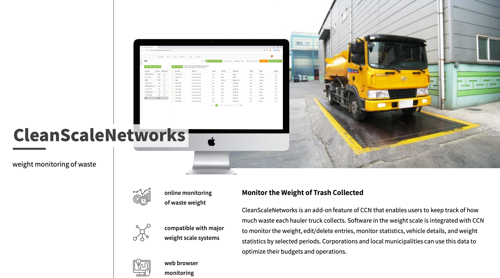

# 고정완 / JeongWan Gho

## 가치관

- 최고의 복지란 최고의 동료입니다.
- 정숙하고 깨끗한 사무실에서 혼자 집중하는 독서실 분위기를 싫어합니다.
- 시끄럽고 난잡하게 의견을 나누고, 그 결과가 깨끗한 코드 혹은 문서로 나타날 때 희열을 느낍니다.
- 기술적으로 소외받는 사람 혹은 분야에서, 새로운 기술 서비스 시장을 찾아낼 수 있다고 믿습니다.
- [책을 좋아합니다.](./book/README.md)

## 이력

활동한 내용을 정리하다가, 양이 많아져서 3개의 링크로 분리했습니다. 
제가 진행한 프로젝트들의 상세 정보를 보고 싶다면 Community, Ecube Labs, UNIST 링크를 꼭! 클릭해주세요.

### [**Community**](./community/README.md)

### [**Ecube Labs**](./ecubelabs/README.md)

- 기간: 2018.10 - 재직중

#### Haulla Back Office 개발

- 기간: 2019.07 -
- 제품 소개 페이지: https://www.haulla.com/

#### CCNx 유지보수

- 기간: 2019.06

#### CleanCityNetworks (CCN) 유지보수

- 기간: 2019.05

#### CleanScaleNetworks (CSN) 개발

- 기간: 2018.10 - 2019.04

### [**UNIST**](./unist/README.md)

#### ClassMate

- [**YouTube**](https://youtu.be/RMkTWNjY1Vc)
- [상세정보](./unist/classmate.md)

<!-- ## 지인 평가

### [이정배](https://github.com)

> 제 평가 좀 적어주세요 ㅎㅎ

### [전태준](https://github.com)

> 제 평가 좀 적어주세요 ㅎㅎ

### [이지은](https://github.com)

> 제 평가 좀 적어주세요 ㅎㅎ

### [유현석](https://github.com)

> 제 평가 좀 적어주세요 ㅎㅎ

### [장훈](https://github.com)

> 제 평가 좀 적어주세요 ㅎㅎ

### [김인수](https://github.com)

> 제 평가 좀 적어주세요 ㅎㅎ

### [윤재진](https://github.com)

> 제 평가 좀 적어주세요 ㅎㅎ -->

<!-- ## 사진

 -->
