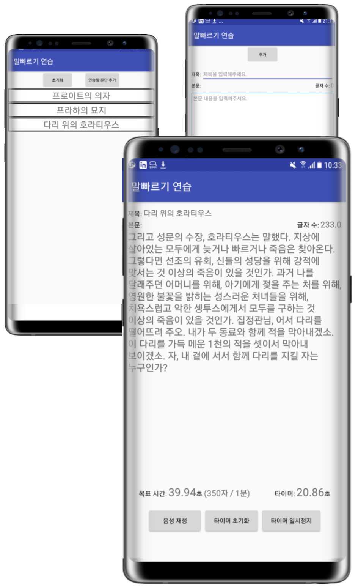

# 고정완 / JeongWan Gho

## 가치관

- 최고의 복지란 최고의 동료입니다.
- 정숙하고 깨끗한 사무실에서 혼자 집중하는 독서실 분위기를 싫어합니다.
- 시끄럽고 난잡하게 의견을 나누고, 그 결과가 깨끗한 코드 혹은 문서로 나타날 때 희열을 느낍니다.
- 기술적으로 소외받는 사람 혹은 분야에서, 새로운 기술 서비스 시장을 찾아낼 수 있다고 믿습니다.
- [책을 좋아합니다.](./book/README.md)
- [커뮤니티 활동을 좋아합니다.](./community/README.md)

## 이력

- [**Ecube Labs**](./ecubelabs/README.md): 2018.10 - 재직중
- [**UNIST**](./unist/README.md): 2013.03 - 2018.09

## 프로젝트

보다 많은 프로젝트들의 상세 정보를 보기 위해 [Ecube Labs](./ecubelabs/README.md) 와 [UNIST](./unist/README.md) 링크를 꼭! 클릭해주세요.

### [**Ecube Labs**](./ecubelabs/README.md)

#### Haulla Back Office 개발

- 기간: 2019.07 - 진행중
- 사용기술: React, Typescript
- 제품 소개 페이지: https://www.haulla.com/
- 설명
  - Haulla 란?
    - 쓰레기 수거자(Hauler)와 생산자(Generator)를 연결해주는 매칭 플랫폼
  - 일반 사용자(Hauler와 Generator)는 모바일 앱을 통해 매칭 서비스를 이용
  - 관리자(쓰레기 수거 회사들)는 Back Office 웹을 통해 쓰레기 수거 서비스를 모니터링 및 관리를 함

#### CleanScaleNetworks (CSN) 개발

- 기간: 2018.10 - 2019.04
- 사용기술: Express, Angular.js
- 설명: 쓰레기 매립지에서 무게를 측정하는 계근 작업을 자동화, 온라인화

### [**UNIST**](./unist/README.md)

#### ClassMate 설계 및 개발 (팀 프로젝트)

- [**YouTube**](https://youtu.be/RMkTWNjY1Vc)
- [Detail](./unist/classmate.md)
- 사용기술: WebRTC, DASH
- 설명: 스마트폰 카메라 및 스크린을 방송하는 앱

#### 발음 교정 앱 (개인 프로젝트)

- 설명: 자신의 발음과 말 빠르기가 얼마나 적절한지 텍스트로 확인할 수 있는 앱
- 사용기술: STT, TTS

<!-- ## 지인 평가

### [이정배](https://github.com)

> 제 평가 좀 적어주세요 ㅎㅎ

### [전태준](https://github.com)

> 제 평가 좀 적어주세요 ㅎㅎ

### [이지은](https://github.com)

> 제 평가 좀 적어주세요 ㅎㅎ

### [유현석](https://github.com)

> 제 평가 좀 적어주세요 ㅎㅎ

### [장훈](https://github.com)

> 제 평가 좀 적어주세요 ㅎㅎ

### [김인수](https://github.com)

> 제 평가 좀 적어주세요 ㅎㅎ

### [윤재진](https://github.com)

> 제 평가 좀 적어주세요 ㅎㅎ -->
