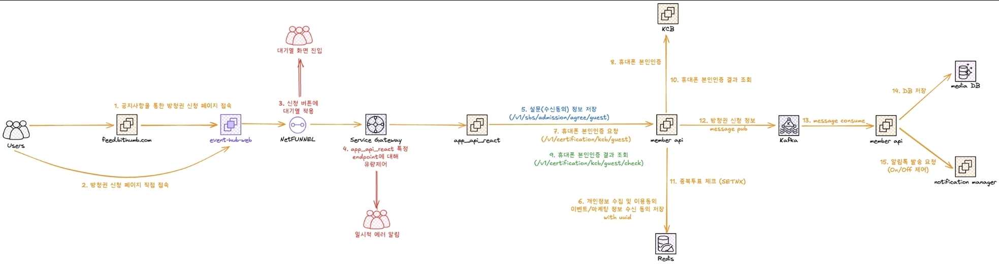

# 빗썸 경력기술

## 요약

- 휴대폰 인증을 통한 SBS 가요대전 방청권 신청 시스템을 개발하여 **1.7만 RPS** 에 대응
- FIU 자료추출에 대비해, 고객/회원 정합성 검증 배치 구현 후, JDBC 튜닝으로 일일배치 소요 시간을 **30분에서 3분** 내외로 단축
- 금융감독원 보안 강화 요구에 따라 모든기기 로그아웃을 구현

## [SBS-151] SBS 가요대전 방청권 신청 이벤트

- 기간: 2025-11
- 개요: SBS 가요대전을 통해 빗썸 마케팅 시도
- 수행: KCB 휴대폰 인증을 활용해 비회원 방청권 신청 로직을 구현
- 결과: 마케팅 활동으로 인해 거래소 서비스에 가해질 위협에 대응 (10분간 50만 신청)
- 방청권으로 인한 거래소 영향을 줄이려는 노력
  - 방청권 신청의 단일 진입 포인트에 Net Funnel 설치
  - Service Gateway 에 Request Rate Limit 을 걸어서 1.7만 RPS 을 넘지 않도록 방지
  - Kafka 이벤트 발행을 통해 Back Pressure 유량 제어
    - 이벤트 발행은 1.8만 RPS 를 감당하지만, DB 쓰기는 1288 TPS 속도로 관리
    - KCB 인증 결과 조회와, 알림톡 발송은 이벤트 Consume 을 통해 처리
  - Redis에 신청내역을 임시 캐싱 후 Write Back 하여 DB 부하 감소
  - 알림톡 과부하 방지를 위한 발송 킬스위치 구현  

## [OPR2-33848] [배치] 고객/회원 정합성 체크

- 기간: 2025-10
- 개요: FIU, 금감원 자료 추출 시 회원/고객 데이터 정합성이 맞지 않는 부분이 존재할 수 있음
- 수행: 회원/고객 데이터의 정합성을 사전에 체크하는 배치 프로그램을 구현
- 결과: 신규 및 수정된 고객 정보를 대상으로 매일 정합성을 체크하여 규제 리스크를 관리

### 정합성 체크 항목

회원 이메일 중복 / 고객 실명번호 중복 / 고객의 회원계정 부재 / 주계정 중복 / 고객 CI 중복

### 대응사례

- 회원 이메일 중복: 동일 인물인지 확인 후, 레거시 계정 때문에 중복된 회원 계정이 존재함을 확인
- 고객 실명번호 중복: 동일 인물인지 확인 후 [OPR2-35640] 에서 과거 계정 제거 조치 중
- 고객의 회원계정 부재: 회원계정이 부재한 고객의 강제 탈퇴처리를 하도록 조치 중

### 배치 성능 최적화

- 락과 트랜잭션으로 인한 실서비스 영향을 JDBC 옵션(READ_ONLY, TYPE_FORWARD_ONLY)으로 방지
- 커서 기반 데이터 순회로 메모리 사용량과 연산 성능을 개선
- 결과: 일일 배치 작업 시간을 30분에서 3분 내외로 단축

### 설명

고객 확인에 문제가 생기면 빗썸 서비스 이용이 불가하여,
나쁜 사용자 경험이 발생합니다.
이를 고객이 경험하기 전에 방지할 수 있도록,
고객 확인 문제의 원인이 되는 정합성을 미연에 체크하는
배치 개발에 참여했습니다.

### 기여내용

- 6백만 고객과 천5십만 회원계정의 정합성 체크 배치를 설계 후 개발했습니다.
- 정합성에 문제가 있을 시 Slack 알림을 보내도록 하였습니다.
- 정합성 체크 전략을 책임연쇄 디자인패턴으로 설계하여, 정합성 로직의 확장성에 대비했습니다.
- JDBCTemplate 의 READ_ONLY 옵션을 활용하여 row 혹은 table 단위의 락을 방지하였습니다.
- 페이지가 아닌 커서 기반으로 처리하여, 대규모 데이터처리에도 서버 메모리 낭비나, DB 성능 낭비가 없도록 했습니다.

## [OPR2-33359] 모든기기 로그아웃 정책 추가

- 기간: 2025-09
- 개요: 금감원의 계정 보안 강화 요구사항 중 '모든 기기 로그아웃' 기능 존재
- 수행: 대고객 모든 기기 로그아웃 구현 후, 관리자용 로그아웃과 로그아웃 메모 조회 기능을 추가
- 결과: FIU 감사에서 지적될 수 있는 항목을 사전에 조치

### 선제적 버그 대응

- 모든 기기 로그아웃 후, 만료된 AccessToken 사용으로 인해 로그인 화면 진입을 못하는 UI 버그가 발생
- 이를 배포전에 인지하고 회의를 소집, 앱 개발자를 추가로 배정받아 인증 모듈을 강제 업데이트
- 로그인 화면으로 이동하지 못하는 버그를 사전에 해결

### 설명

감독원에서 요구한 명시적인 모든기기 로그아웃 기능과,
이력 체계에 관한 BE 개발 및 대응을 담당했습니다.

### 기여내용

- 모든기기 로그아웃을 대고객용과 관리자용으로 각각 구현했습니다.
- 로그아웃 이력이 계정잠금 이력과 통합되도록 로깅 체계와 화면을 개편했습니다.
- 비밀번호 변경 후 모든기기 로그아웃이 병행되도록 트리거를 걸었습니다.
- 로그아웃 후 필요한 캐시 지우기 동작을 찾아내어, 자동으로 캐시가 지워지도록 구현했습니다.
- 운영배포 되기 전 로그인 화면 재진입 버그 원인을 찾는데 기여하여, 의도치 않은 사용자 경험을 방지했습니다.

## [OPR2-33222] 법인 업종 구분 코드 거래소 반영

- 기간: 2025-09
- 개요: 법인의 CDD 인, 업종 구분이 '기타'로 분류되어 어떤 사유로 법인이 코인 자산을 획득 및 매각했는지 불명확
- 수행: 업종 구분 코드를 신규로 추가하여 법인 업종을 명확하게 세분화
- 결과: 인천검찰청의 법 집행에 따른 자산 매각 절차를 명확히 할 수 있는 기반을 마련

### 설명

- 중요 CDD 인 업종구분코드가 신규로 추가되었습니다.
- AML DB 와 동일한 코드를 갖도록 거래소 DB 를 보정했습니다.
- 법인고객과 일반고객의 모델 구조를 비교하여, 반영이 필요한 코드를 이해했습니다.
