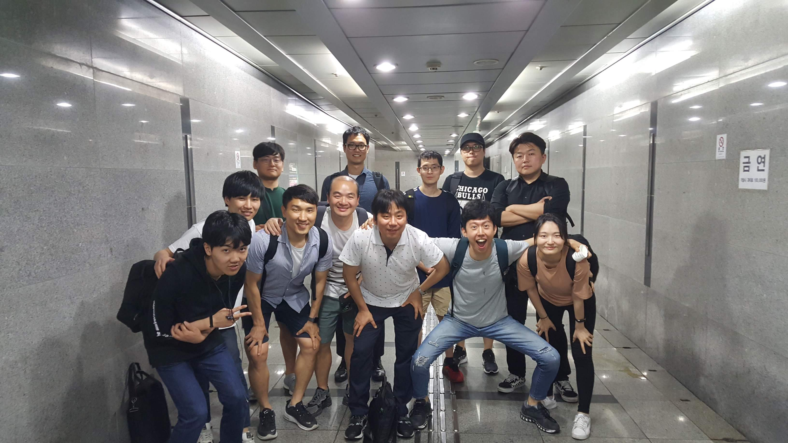
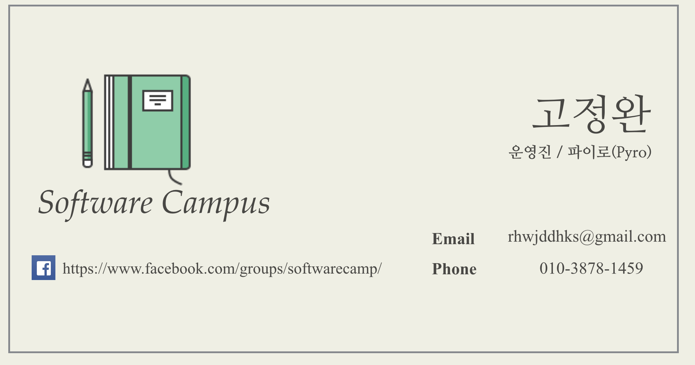
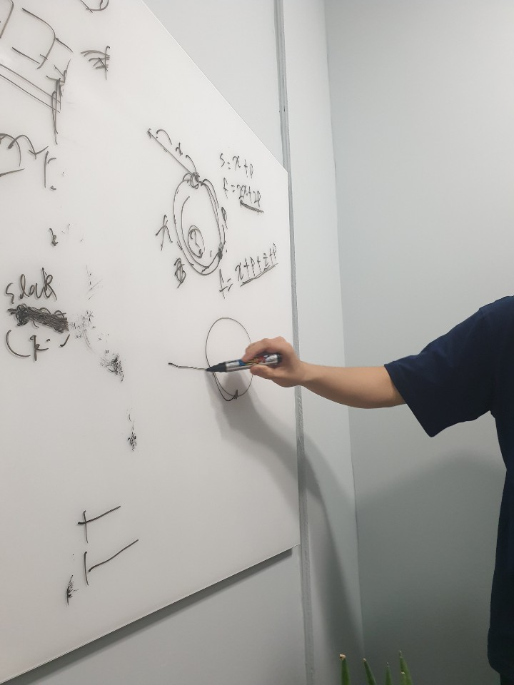
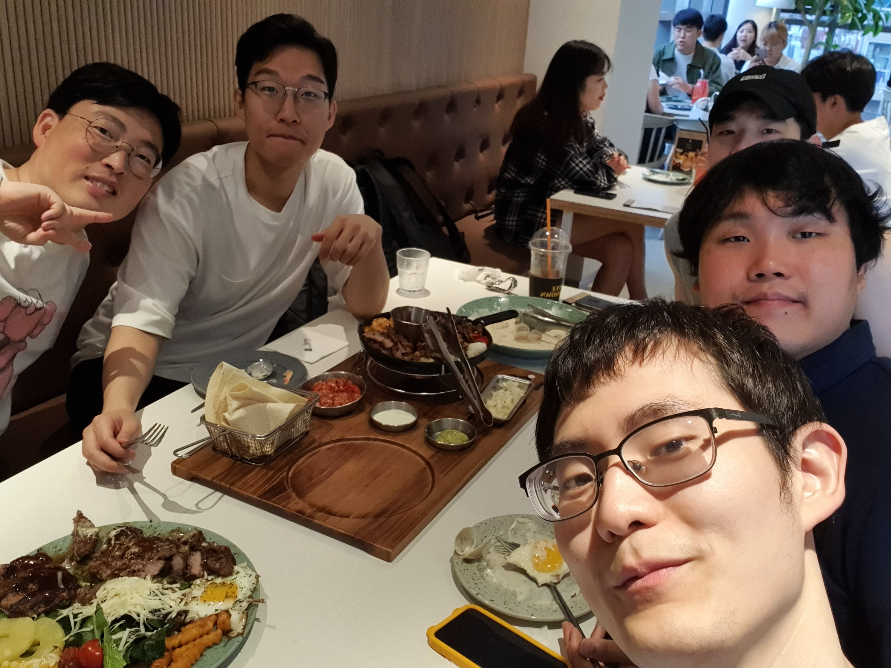
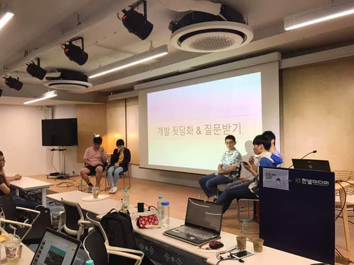

# Community Activities Description

제가 참여한 커뮤니티 활동들에 대한 상세 설명입니다.

## 현재 회원으로 활동 중인 커뮤니티

- [자바 카페](http://tech.javacafe.io/about/)
- [소프트웨어 캠퍼스](https://www.facebook.com/softwarecamp/)

## 알고리즘 스터디

- 기간: 2019.09 - 2019.11
- 링크: https://github.com/study-records/coding-interview-study
- 설명
  - 혼자서는 어려웠던 알고리즘 공부에 도전하고 싶어서 열은 스터디입니다.
- 기억에 남는 점

  - 연말에 육군 훈련소에 가게 되어 스터디가 일시중지 되었는데, 훈련소를 수료하자마자 스터디가 언제 다시 열리냐는 연락을 받아서 감동했습니다.
  - 스터디원들을 위해 더 열심히 공부해야겠다는 새해 다짐을 했습니다.

    

## <모던 자바스크립트 입문> 책 스터디

- 기간: 2019.07 - 2019.09
- 링크: https://github.com/study-records/modern-javascript-study/tree/master/Modern_Javascript_Primer
- 설명
  - 자바스크립트에 대한 이해도를 높이고 싶어서 시작한 스터디입니다.
  - 공부했던 내용을 문서로 정리해서 gitHub 에 올렸습니다.
- 기억에 남는 점

  - 자바를 본업으로 삼고 계시는 경력직 개발자분들도, 언제나 새로운 학습에 목말라 있다는 열정이 참 대단하다고 느꼈습니다.
  - 본받고 싶은 분들을 많이 만나 행복했습니다.

   

## 공감 세미나 주니어

- 기간: 2019.03 - 2019.06
- 링크: http://www.hanbit.co.kr/store/education/edu_view.html?p_code=S3414110334
- 설명
  - 한빛미디어 후원으로 열었던 유료 세미나입니다.
  - 본인이 직접 기획하고, 준비하고, 발표자로 참가했습니다.
  - 본인이 2개의 세션을 발표했습니다.
    - 첫번째 세션: 개발자가 되고 싶은 대학생 및 성인을 대상으로, 주니어로서 겪었던 어려움들을 이야기했습니다.
    - 두번째 세션: 개발자로 취업을 희망하는 친구들과 2개월 간 만든 미니 프로젝트를 발표했습니다.
- 기억에 남는 점
  - 1만 1천원을 지불한 사람들이 80명 넘게 강의장을 꽉 채웠습니다.
  - 준비를 할 때도 긴장했지만, 발표를 할 때는 더욱 긴장해서 다리에 힘이 들어가지 않아 중간중간 의자에 앉아야 했습니다.
  - 발표가 끝나고 나서, 제가 기대했던 것 이상의 박수 소리에 기뻐서 몸을 떨었던게 기억납니다.
  - 행사가 끝나고 긴장이 풀리자, 화장실로 가서 헛구역질 했던게 기억납니다.
  - 이때부터 커뮤니티 활동이라는 스릴에 중독이 된 것 같습니다.

