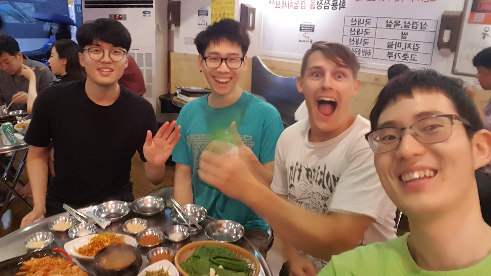

# Community Activities Description

고정완이 참여한 커뮤니티 활동들에 대한 상세 설명입니다.

## 현재 회원으로 활동중인 커뮤니티

- [자바 카페](http://tech.javacafe.io/about/)
- [소프트웨어 캠퍼스](https://www.facebook.com/softwarecamp/)

## 공감 세미나 주니어

- 기간: 2019.03 - 2019.06
- 링크: http://www.hanbit.co.kr/store/education/edu_view.html?p_code=S3414110334
- 설명

## <모던 자바스크립트 입문> 책 스터디

- 기간: 2019.07 - 2019.09
- 링크: https://github.com/study-records/modern-javascript-study/tree/master/Modern_Javascript_Primer

## 알고리즘 스터디

- 기간: 2019.09 - 2019.10
- 링크: https://github.com/study-records/coding-interview-study

