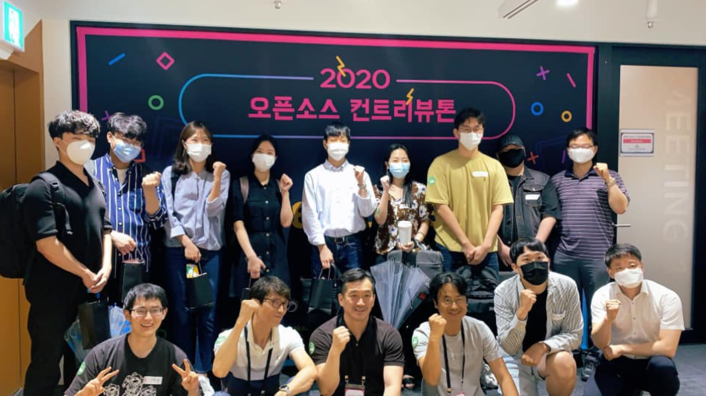
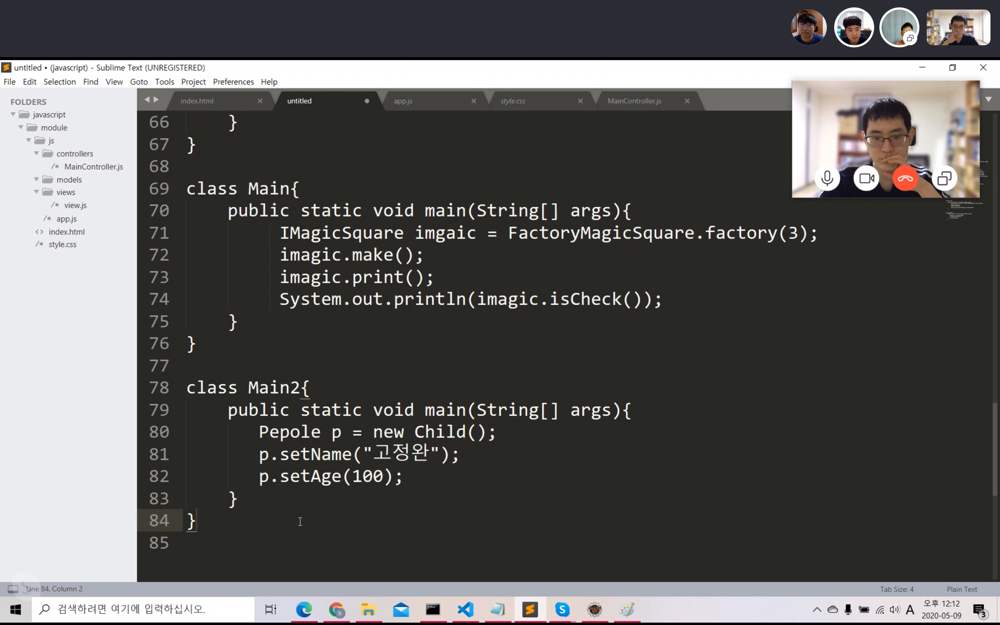

# Community Activities Description

제가 참여한 커뮤니티 활동에 대한 상세 설명입니다.

- [오픈소스 컨트리뷰톤 수상](#%EC%98%A4%ED%94%88%EC%86%8C%EC%8A%A4-%EC%BB%A8%ED%8A%B8%EB%A6%AC%EB%B7%B0%ED%86%A4-%EC%88%98%EC%83%81)
  - 기간: 2020.08 - 2020.09
- [디자인 패턴 스터디](#%EB%94%94%EC%9E%90%EC%9D%B8-%ED%8C%A8%ED%84%B4-%EC%8A%A4%ED%84%B0%EB%94%94)
  - 기간: 2020.04 - 2020.10
- [알고리즘 스터디](#%EC%95%8C%EA%B3%A0%EB%A6%AC%EC%A6%98-%EC%8A%A4%ED%84%B0%EB%94%94)
  - 기간: 2019.09 - 2019.11
- [<모던 자바스크립트 입문> 책 스터디](#%EB%AA%A8%EB%8D%98-%EC%9E%90%EB%B0%94%EC%8A%A4%ED%81%AC%EB%A6%BD%ED%8A%B8-%EC%9E%85%EB%AC%B8-%EC%B1%85-%EC%8A%A4%ED%84%B0%EB%94%94)
  - 기간: 2019.07 - 2019.09
- [공감 세미나 주니어](#%EA%B3%B5%EA%B0%90-%EC%84%B8%EB%AF%B8%EB%82%98-%EC%A3%BC%EB%8B%88%EC%96%B4)
  - 기간: 2019.03 - 2019.06

## 현재 회원으로 활동 중인 커뮤니티

- [Cloud-Barista](https://cloud-barista.github.io/)
- [Java Cafe](http://tech.javacafe.io/about/)
- [Software Campus](https://www.facebook.com/softwarecamp/)

## 오픈소스 컨트리뷰톤 수상

- 기간: 2020.08 - 2020.09
- 링크: <https://www.oss.kr/contributhon_project/show/e06eb6b5-25d9-4be4-92ea-c24ceda137b0>
- 설명
  - 정보통신산업진흥원에서 주최하는 오픈소스 컨트리뷰톤 행사에 참가하여 특별상을 수상했습니다.
  - 행사 활동을 통해 멘토단이 소속되어 있는 Cloud-Barista 오픈 소스 커뮤니티에 가입하게 되었습니다.

  
  

    
    
  

## 디자인 패턴 스터디

- 기간: 2020.04 - 2020.10
- 링크: <https://github.com/ghojeong/GoF>
- 설명
  - GoF의 디자인 패턴을 공부하고자 열은 스터디입니다.

    

## 알고리즘 스터디

- 기간: 2019.09 - 2019.11
- 링크: <https://github.com/ghojeong/CtCI>
- 설명
  - 혼자서는 어려웠던 알고리즘 공부에 도전하고 싶어서 열은 스터디입니다.
- 기억에 남는 점
  - 2019년 12월에 육군 훈련소에 가게 되어 스터디가 중지 되었는데, 훈련소를 수료하자마자 스터디가 언제 다시 열리냐는 연락을 받아서 감동했습니다.
  - 스터디원 분들을 위해 더 열심히 공부해야겠다는 새해 다짐을 했습니다.

    

## <모던 자바스크립트 입문> 책 스터디

- 기간: 2019.07 - 2019.09
- 링크: <https://github.com/study-records/modern-javascript-study/tree/master/Modern_Javascript_Primer>
- 설명
  - 자바스크립트에 대한 이해도를 높이고 싶어서 시작한 스터디입니다.
  - 공부했던 내용을 문서로 정리해서 gitHub 에 올렸습니다.
- 기억에 남는 점
  - 자바를 본업으로 삼고 계시는 경력직 개발자분들도, 언제나 새로운 학습에 목말라 있다는 열정이 참 대단하다고 느꼈습니다.
  - 본받고 싶은 분들을 많이 만나 행복했습니다.

   

## 공감 세미나 주니어

- 기간: 2019.03 - 2019.06
- 링크: <http://www.hanbit.co.kr/store/education/edu_view.html?p_code=S3414110334>
- 설명
  - 한빛미디어 후원으로 열었던 유료 세미나입니다.
  - 본인이 직접 기획하고, 준비하고, 발표자로 참가했습니다.
  - 본인이 2개의 세션을 발표했습니다.
    - 첫번째 세션: 개발자가 되고 싶은 대학생 및 성인을 대상으로, 주니어로서 겪었던 어려움을 이야기했습니다.
    - 두번째 세션: 개발자로 취업을 희망하는 친구들과 2개월 간 만든 미니 프로젝트를 발표했습니다.
- 기억에 남는 점
  - 1만 1천원을 지불한 사람들이 80명 넘게 강의장을 꽉 채웠습니다.
  - 준비를 할 때도 긴장했지만, 발표를 할 때는 더욱 긴장해서 다리에 힘이 들어가지 않아 중간중간 의자에 앉아야 했습니다.
  - 발표가 끝나고 나서, 제가 기대했던 것 이상의 박수 소리에 기뻐서 몸을 떨었던게 기억납니다.
  - 행사가 끝나고 긴장이 풀리자, 화장실로 가서 헛구역질 했던게 기억납니다.
  - 이때부터 커뮤니티 활동이라는 스릴에 중독이 된 것 같습니다.

