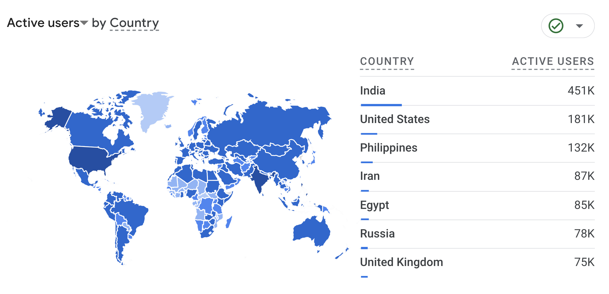
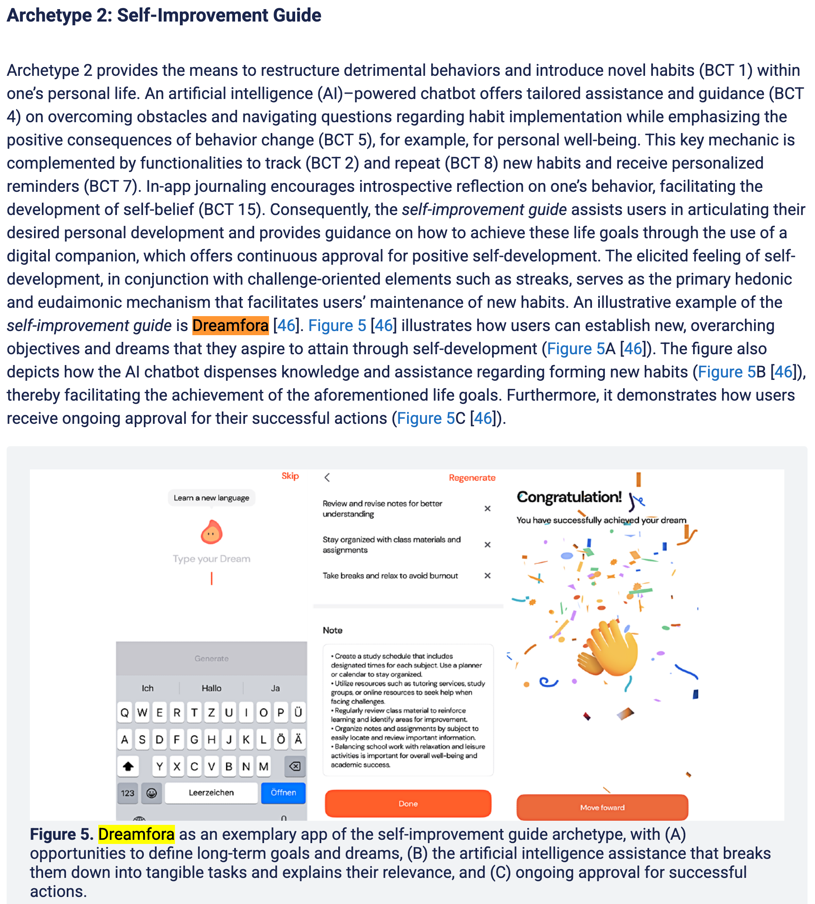
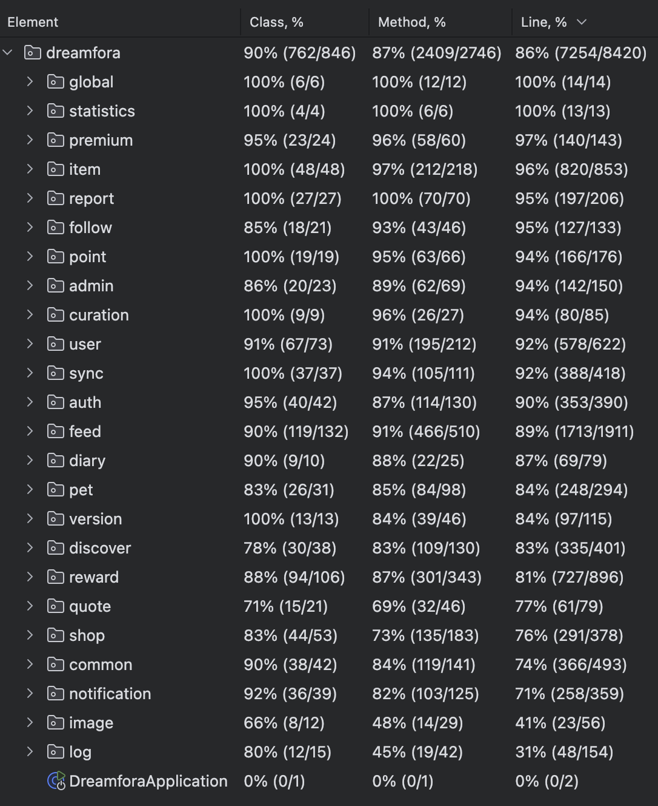
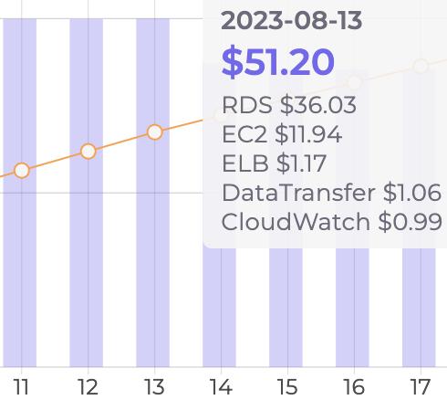
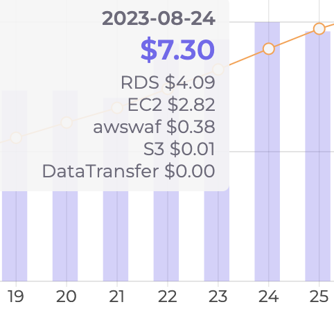
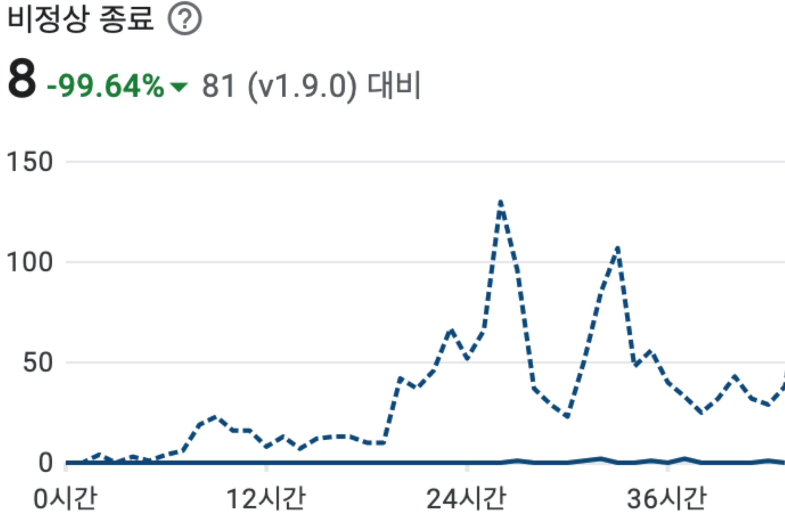

# [Dreamfora](https://play.google.com/store/apps/details?id=com.dreamfora.dreamfora) 경력기술

- 200만 다운로드, MAU 16만, [미국 앱스토어 피쳐드](https://apps.apple.com/us/story/id1681928254)된 B2C 목표관리 앱
- 독일의 FAU(프리드리히 알렉산더 대학) 연구진에 의해 [Self-Improvement 우수사례로 저널 논문](https://www.jmir.org/2025/1/e65214/)이 등재
- 근속기간: 2021.08.25 - 2025.03.25
- 사용기술: Java, Spring Boot, Spring Security, JPA, MariaDB
- 주요성과
  - IDC에서 AWS 클라우드로 전환 후 [**장애빈도 99% 감소**](#aws-클라우드로-인프라를-전환)
  - 쿼리튜닝과 스키마 재설계로 [**서버비용 82% 절약**](#db-스키마-재설계-및-쿼리-튜닝)
  - ATDD Cycle 을 통해 [테스트 커버리지 86% 달성](#프레임워크-업그레이드)
  - 세션 기반에서 토큰 기반 인증으로 전환 후 [인증시간 93% 단축](#세션-기반-인증을-jwt-기반-인증으로-리팩토링)

## 요약

- [연도별 구현기능](#연도별-구현기능)
  - 2025년: 상점, 시즌별 아이템
  - 2024년: 포인트, 출석 Streak, 펫, 다이어리
  - 2023년: Feed 커뮤니티, 검색, Follower, 인기도, 알림
  - 2022년: 데이터 자동싱크, 목표 실행계획 모델링, 목표 실행계획 공유
  - 2021년: 목표와 실행계획을 적는 메모장
- 운영 및 리팩토링
  - Batch, 로깅 시스템, ATDD Cycle
  - 쿼리튜닝, 스키마 재설계, 데이터 마이그레이션
  - AWS 클라우드 전환, 이중화, Private Cloud, CI/CD

<!-- 

 -->

## 연도별 구현기능

- 2025년
  - 상점 아이템과 Feed 커뮤니티 연계
  - 상점에 시즌 개념 도입
- 2024년
  - 상점
  - 다이어리
  - 쿠폰 시스템
  - 포인트를 이용한 랜덤박스
  - 펫 키우기
  - 포인트 보상을 위한 출석 Streak 도입
  - 포인트 시스템 구축
    - 미션 수행에 따라 포인트 획득
    - 현금성 포인트와, 일반 포인트를 분리
    - 유효기간 1년이 지나면 소멸
  - 유저 검색
- 2023년
  - 정기구독과 AdMob 도입
    - 계획수행 히스토리와 시각화를 고도화
  - Follower 및 인기도 시스템
  - Notification
  - 순위에 따른 Hot Feed 카테고리
  - Feed 커뮤니티
    - 게시글
    - 댓글과 대댓글
    - 좋아요
    - 좋아요와 조회수에 따른 순위
    - 이미지 서버
    - 게시글 검색
- 2022년
  - 데이터 자동 싱크
  - 동기부여되는 Quote 를 주기적으로 보여주기
  - 계획수행 히스토리를 수집하고, 그래프로 시각화
  - 목표 실행계획 공유
    - 관리자가 모범 목표 실행계획을 세워서 공유
    - 일반 사용자끼리도 목표 실행계획을 공유가능
  - 목표 실행계획을 구조화
    - Dream: 목표
    - Habit: 목표달성을 위해 주기적으로 반복해야하는 습관
    - Task: 목표달성을 위해 해내야하는 마일스톤
- 2021년
  - 목표를 세우고, 실행계획을 적는 메모장 기능

## 운영 및 리팩토링

### 프레임워크 업그레이드

- 기간: 2024.08 - 2024.11
- 사용기술: Java21, Spring Boot 3.3, Gradle 8.10
- 성과: 서비스 장애 없는 프레임워크 업그레이드
- 설명
  - Java 11, Spring Boot 2.6, Gradle 7.1 에서 Java 21, Spring Boot 3.3, Gradle 8.10 으로 버전을 올렸습니다.
  - 버전 업그레이드 후 통과되지 못한 테스트가 245개 였습니다.
  - **테스트 커버리지가 86%** 였기에, 테스트를 모두 통과하도록 수정하면 실서비스 장애도 없을거라는 자신이 있었습니다.
  - 실서비스 배포 후 서비스 장애가 전혀 일어나지 않았습니다.

### Batch 서버

- 기간: 2024.06 - 2024.07
- 사용기술: Crontab, Bash shell, mysqldump
- 성과: 로깅 시스템의 Storage 비용감소
- 설명
  - 배치로 관리자용 통계를 집계했습니다.
  - 배치로 정기적인 api_log 백업을 구현하여, 로그를 가격이 싼 S3 스토리지로 옮겼습니다.

### 로깅 시스템과 실서비스의 의존성 분리

- 기간: 2024.04 - 2024.05
- 사용기술: Spring Event, Async Scheduling
- 성과: 로깅으로 인한 장애와 성능저하 제거
- 설명
  - 로깅으로 실서비스에 영향이 가지않도록, 실서비스 DB 와 로깅용 DB 를 이원화 하였습니다.
  - 로깅으로 실서비스의 성능이 나빠지지 않도록, 이벤트 발급을 통한 비동기처리로 로깅을 하였습니다.

### 모니터링을 위한 API 로깅 시스템 구축

- 기간: 2024.01 - 2024.03
- 사용기술: Servlet Filter, Spring Interceptor, JPA Auditing
- 성과: API 비정상 호출에 대한 모니터링과 디버깅이 가능해짐
- 설명
  - API 의 모든 Request 와 Response 를 검색 가능한 형태로 로그를 남겼습니다.
    - http_uri 에 인덱스를 걸고 AUTO_INCREMENT PK 역순으로 정렬했습니다.
  - API 를 호출한 사용자 인증 정보를 JPA Auditing 을 통해 수집하여 저장했습니다.
  - API 정상 호출과 비즈니스 로직의 에러는 Spring Interceptor 를 통해 로그를 남겼습니다.
  - 인증, 인가 관련 에러는 Servlet Filter 를 통해 로그를 남겼습니다.
  - Spring Intercetor 외에  Servlet Filter 가 필요했던 이유
    - Spring Security 의 인증, 인가 관련 에러는 보안 문제이기 떄문에 Spring Context 바깥에서 처리됩니다.

### 재설계한 스키마로 데이터 마이그레이션

- 기간: 2023.09 - 2023.12
- 사용기술: Spring Batch, JPA BatchStatement, EntityManager
- 성과: 데이터 정합성 검증
- 설명
  - 마이그레이션 로직이 복잡했기에, 테스트 코드를 통해 데이터 정합성을 검증하기로 결정했습니다.
  - Stored Procedure 로 작성한 마이그레이션 로직을 JPA 를 통해 자바 코드로 옮겼습니다.
  - 자바 코드로 옮겨진 마이그레이션 로직을 JUnit 을 활용해 테스트 코드로 검증했습니다.
    - 엔티티의 단위 테스트를 통해 서비스 동작에 필요한 최소 데이터를 검증하였습니다.
  - JPA 로 Batsh Size 보다 많은 대규모 INSERT 를 하기 위해, EntityManager 를 커스텀했습니다.
    - EntityManager 는 엔티티를 save 시 INSERT 해야하는지 UPDATE 하는지 확인합니다.
    - 확인 과정에서 N+1 의 SELECT 쿼리가 발생합니다.
    - Persistable 인터페이스를 상속하여 isNew 를 항상 true 로 하니 SELECT 없이 벌크 INSERT 가 되었습니다.
  - JPA 의 rewriteBatchedStatements 옵션을 활용했습니다.
  - 최소 데이터 검증과 EnitityManager 커스텀을 통해 **1시간 넘게 걸리던 마이그레이션 작업이 15분 내외**로 줄었습니다.
  - 최소 데이터 이외의 데이터는 Batch 작업을 통해 천천히 옮기는 방식을 취했습니다.

### DB 스키마 재설계 및 쿼리 튜닝

- 기간: 2023.06 - 2023.08
- 사용기술: MariaDB, Stored Procedure, TDD
- 성과: **서버비용 82% 절약**
- 설명
  - 재귀쿼리 혹은 N+1 쿼리를 사용하는 경우를, JOIN 쿼리로 해결할 수 있도록 스키마를 재설계했습니다.
    - 재귀쿼리의 정지조건이 잘못된 경우 서버 성능에 심각한 영향을 끼쳤습니다.
  - SQL Stored Procedure 로 정의된 로직을 Java 엔티티 객체로 옮겼습니다.
  - 엔티티 객체로 옮긴 로직은 단위 테스트를 통해 검증했습니다.
  - 쿼리 플랜을 확인하며, 필요한 인덱스를 걸었습니다.
  - 리팩토링과 최적화 덕분에 필요한 서버 리소스가 하루 **51.2달러에서 7.3달러** 로 줄었습니다.
  - 최종적으로는 서버비용이 한달 **1518달러에서 270달러** 로 줄었습니다.

### 인수 테스트를 통한 문서화

- 기간: 2023.04 - 2023.05
- 사용기술: ATDD, REST Assured, REST Docs
- 성과: 서버와 모바일 인터페이스가 달라서 생긴 버그 해결
- 설명
  - 인수 테스트를 통해 API 문서가 자동 생성되도록 환경을 구축했습니다.
  - ATDD Cycle 을 통해 **테스트 커버리지 86%** 를 달성했습니다.
  - 모바일과의 인터페이스를 맞추기 위해, 모바일 DTO 객체를 직접 읽어가며 테스트를 작성했습니다.
  - 테스트 작성 후에는 Layered 아키텍처를 도입했습니다.
    - Controller 에 뭉쳐있는 로직을 Servie 로 분리했습니다.
    - Service 로 분리된 로직 중 단위테스트 작성이 가능한 로직은 순수 객체로 분리했습니다.

### 세션 기반 인증을 JWT 기반 인증으로 리팩토링

- 기간: 2023.01 - 2023.03
- 사용기술: Spring Security, JWT
- 성과: **인증시간 93% 단축**
- 설명
  - 세션 기반의 인증 구조를 sessionless 형태로 리팩토링했습니다.
  - 모바일 클라이언트에서 session id 가 아니라 JWT 토큰을 관리하도록 했습니다.
  - 일주일마다 갱신이 필요한 accessToken 과 반년동안 유효한 refreshToken 을 구분했습니다.
  - Spring Security 의 SecurityContext 로 인증정보를 제공하여, creator 와 updater 로그를 남기도록 했습니다.
  - 인증시간이 **8초 내외에서 0.5초** 이내로 단축되었습니다.
    - 단축원인1: 세션으로 메모리가 아닌 Storage 를 사용하고 있었습니다.
    - 단축원인2: 세션 TTL 이 없어, 8천만개의 세션이 휘발되지 않고 쌓여있었습니다.
    - 단축원인3: 세션에 인덱스가 걸리지 않아 항상 풀스캔하였습니다.

### 무중단 배포 파이프라인 구축

- 기간: 2022.11 - 2022.12
- 사용기술: ECS, Port Forwarding, Rolling 배포, Blue-Green 배포, CodePipeline
- 성과: 업데이트 시 서비스 중단을 공지할 필요가 없게됨
- 설명
  - dev 와 stage 서버는 NGINX 를 이용한 포트 포워딩을 통해 Blue-Green 배포를 하였습니다.
    - 배포는 직접 쉘스크립트를 작성하여 실행했습니다.
  - production 서버는 ECS 를 이용한 Rolling 배포 방식을 취했습니다.
    - CodePipeline 을 통해, 빌드 후 ECS 에게 전달했습니다.
  - dev, stage 를 위해 Blue-Green 방식을 선택한 이유
    - 배포 스크립트를 작성하기 가장 단순했습니다.
  - production 을 위해 Rolling 방식을 선택한 이유
    - 새 업데이트에 문제가 있을 시, Blue-Green 보다 더 빠르게 롤백 대응을 할 수 있었습니다.
    - Canary 방식은 로드밸런서와 헬스체크의 고도화가 필요했는데, 오버 엔지니어링 같아서 도입하지 않았습니다.

### AWS 클라우드로 인프라를 전환

- 기간: 2022.07 - 2022.10
- 사용기술: EC2, RDS, S3, ALB, VPC, CloudFront, Route53, IAM
- 성과: AWS 스타트업 Credit 지원을 받게 됨
- 설명
  - "닷홈 호스팅" 이라는 한국의 IDC 업체로 운영되던 인프라를 AWS 클라우드로 전환했습니다.
  - VPC 를 활용해 DB 를 사설망으로 분리했습니다.
  - bastion host 를 통해서만 사설망에 접근가능하도록 보안설정했습니다.
  - 로드밸런서를 통해 WAS를 이중화하여 Fault Tolerance 강화했습니다.
    - 이중화 작업 이후엔 **장애빈도가 99% 감소**되었습니다.
  - RDS 복구를 위한 백업을 설정했습니다.
  - DNS 의 Name Server 이전을 위해 Redirect 프록시 서버 구축했습니다.
    - Name Server 의 48시간 TTL 때문에, 서버를 찾지 못하는 문제를 예방했습니다.
  - dev, stage, production 인프라를 분리했습니다.
    - dev: 버전관리가 필요없는 개발자용 샌드박스
    - stage: 버전단위로 QA 되는 서버
    - production: 이중화와 망분리가 된 실서버

### 안드로이드 네이티브 전환

- 기간: 2022.01 - 2022.06
- 사용기술: Kotlin, Android, Room, Hilt
- 성과: 서버 이중화 작업 이후 **장애빈도 99% 감소**
- 설명
  - 자마린으로 된 애플리케이션을 안드로이드 네이티브로 갈아엎었습니다.
  - 어떻게 애플리케이션을 구현할지, 아키텍처를 제시하고 팀원들과 합의점을 만들어냈습니다.
  - [Repository 패턴](https://velog.io/@pyro/android-module2)을 도입했고, 이와 관련된 사내 교육 세션을 진행했습니다.
  - 단위 테스트와 Lint 검사를 자동화 하는 개발환경을 도입했습니다.
  - app, data, domain 을 별개의 모듈로 의존성 분리를 해냈습니다.

### git 도입

- 기간: 2021.10 - 2021.12
- 사용기술: git
- 성과: 형상관리를 통해 버전 롤백이 가능하게됨
- 설명
  - 회사에 git flow 와, 코드리뷰 문화를 처음 도입했습니다.
  - "팀 개발을 위한 Git, GitHub 시작하기" 책을 기준으로 스터디를 진행했습니다.
  - 엑셀이 아니라, GitHub 이슈를 통해 작업단위를 쪼개는 문화를 도입했습니다.
  - 개발 진행상황을 GitHub Projects 로 시각화하였습니다.
  - 개발과정에서 일어난 의논을 코드 리뷰를 통해 자산화 할 수 있도록 하였습니다.

### 관리자 페이지 유지보수 및 배포 스크립트 작성

- 기간: 2021.08 - 2021.09
- 사용기술: Docker, Bash shell, Spring, React
- 성과: 도커화로 실행 및 빌드환경의 일관성 확보
- 설명
  - Spring 과 React 기반의 관리자 페이지를 유지보수 했습니다.
  - bash 쉘로 배포 스크립트를 작성했습니다.
  - 도커화를 통해, 로컬에서의 개발 환경을 구축했습니다.
