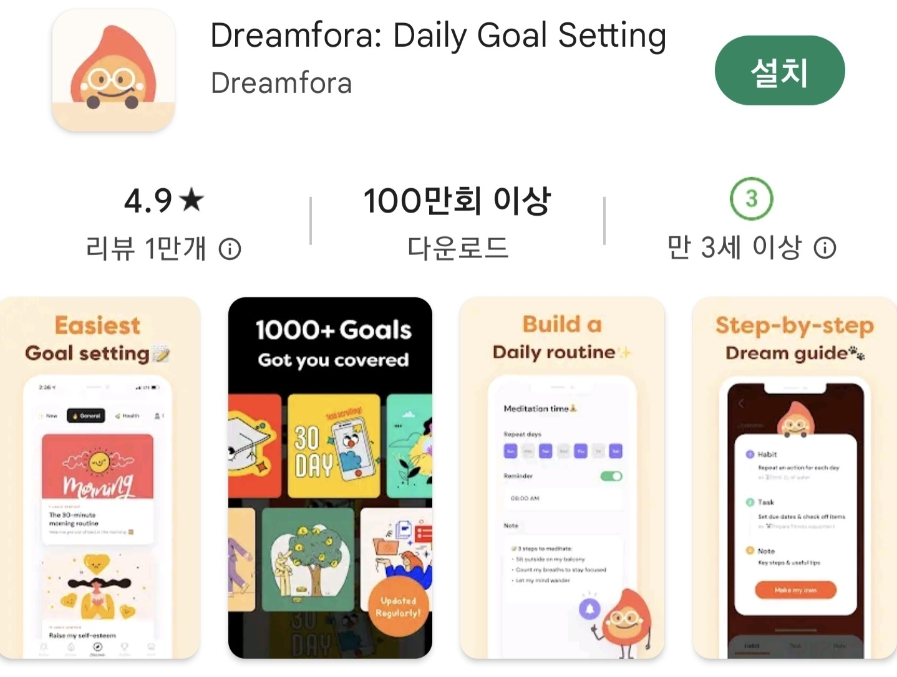
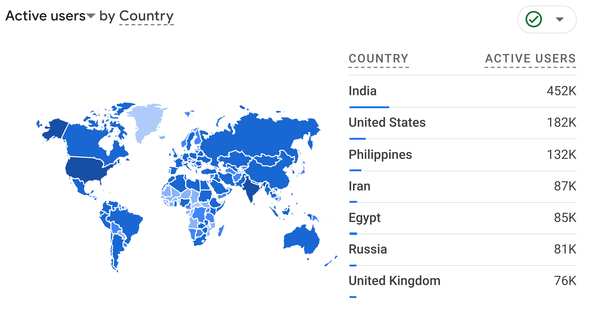
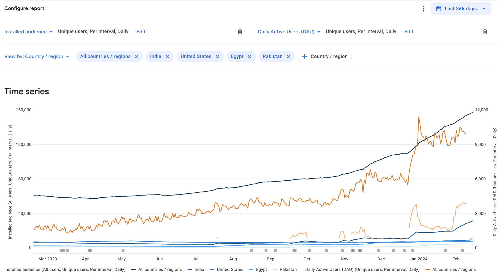
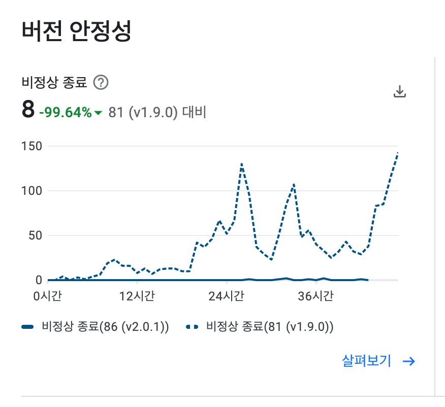
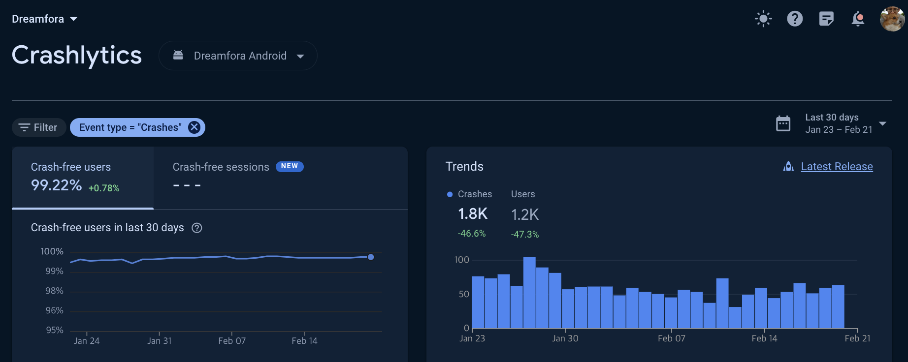

# [Dreamfora](https://play.google.com/store/apps/details?id=com.dreamfora.dreamfora) 경력기술

- 200만 다운로드, [미국 앱스토어 피쳐드](https://apps.apple.com/us/story/id1681928254)

## 기능구현

### 2025

- 상점 물품과 Feed 연계
- 상점에 시즌 개념 도입

### 2024

- 상점 기능 구현
- 쿠폰 시스템 구현
- 포인트를 이용한 랜덤박스 기능 구현
- 펫 키우기 기능 구현
- 포인트 시스템 구축

### 2023

- 정기구독 결제와 AdMob 도입
- Follower 및 인기도 시스템 구현
- Feed 커뮤니티 구현
- Notification 기능 구현
- 이미지 다중 업로드
- 게시글 기능 구현
- 댓글과 대댓글 구현
- 좋아요 기능 구현

### 2022

- 자동 싱크 기능 구현
- Quote 기능 구현
- 목표계획 공유 기능 구현
  - 모범 목표 계획을 관리자가 세워서 공유

### 2021

- 목표관리를 위한 모델링 (Dream, Habit, Task 구조)

## 운영 및 리팩토링

### 이미지 중개 서버 구현

- 기간: 2024.01 - 2024.02
- 설명
  - CloudFlare 뿐만 아니라 S3 를 활용한 다른 이미지 서버를 염두해두고 중개하는 서버를 구현했습니다.
  - 기존의 이미지 업로드 인터페이스 규약을 유지하여 클라이언트 수정이 없도록 하였습니다.

### 배치 서버 구현

- 기간: 2023.09 - 2023.12
- 설명
  - 테스트 주도로 개발 가능한 배치 서버 구현했습니다.
  - 배치로 정기적으로 Dream 복사 숫자 집계 기능 구현했습니다.
  - 배치로 정기적인 api_log 백업을 구현하여, 로그를 가격이 싼 S3 스토리지로 옮겼습니다.

### 쿼리 튜닝, 객체 및 DB 모델 리팩토링, 인프라 재구축

- 기간: 2023.04 - 2023.08
- 설명
  - N + 1 쿼리가 발생하는 JPA 레포지토리를 전부 찾아내서 리팩토링했습니다.
  - JOIN 하는 테이블 갯수가 4개 이하가 되도록 DB 스키마를 전부 새롭게 모델링했습니다.
  - 새롭게 모델링한 스키마에 오래된 스키마의 데이터를 마이그레이션했습니다.
  - 최적화한 DB 와 WAS 에 필요한 성능에 맞추어 인프라를 재구축 했습니다.
  - 실서비스에 영향이 가지 않도록 dev, stage, production 의 인프라를 나누어야 한다고 경영진을 설득해냈습니다.
  - production 인프라는 DB 의 망분리를 진행하여, public IP 가 할당되지 않도록 했습니다.
  - 슬로우 쿼리를 모니터링할 수 있는 인프라를 구축했습니다.
  - API request, response, duration 을 기록하는 로깅 시스템을 구축했습니다.
  - 로깅 시스템으로 인해 스토리지가 꽉 차면 로그를 지우는 배치서버를 구현했습니다.
  - 리팩토링과 최적화 덕분에 인프라 비용이 월 **216만원에서 73만원** 으로 줄었습니다.
  - 전부 혼자했습니다.

### ATDD 도입, 세션 기반 인증을 JWT 기반 인증으로 리팩토링

- 기간: 2023.01 - 2023.05
- 링크: <https://github.com/ghojeong/SpringBoilerPlate>
- 설명
  - 모바일 서비스임에도, Session ID 와 세션 기반의 인증 구조를 사용하고 있었습니다.
  - JWT Bearer Token 을 통한 인증을 하도록 Spring 서버와 안드로이드를 리팩토링했습니다.
  - Spring Security 와 JPA Auditing 을 이용해 데이터의 creator 와 updater 에 관한 로그를 남겼습니다.
  - Rest Docs 와 인수 테스트를 활용한 문서화를 도입했습니다.

### 안드로이드 네이티브 전환

- 기간: 2022.01 - 2022.06
- 링크: <https://velog.io/@pyro/android-module2>
- 설명
  - 자마린으로 된 애플리케이션을 안드로이드 네이티브로 갈아엎었습니다.
  - 어떻게 애플리케이션을 구현할지, 아키텍처를 제시하고 팀원들과 합의점을 만들어냈습니다.
  - [Repository 패턴](https://github.com/java-squid/2022-jubilant/pull/18#issuecomment-1067434341)을 도입했고, 이와 관련된 사내 교육 세션을 진행했습니다.
  - 단위 테스트와 Lint 겁사를 자동화 하는 개발환경을 도입했습니다.
  - app, data, domain 을 별개의 모듈로 의존성 분리를 해냈습니다.
  - 백그라운드 서비스를 최소화하여, 크래시율을 99% 낮추었습니다.

### git 도입

- 기간: 2021.08 - 2022.06
- 설명
  - 회사에 git flow 와, 코드리뷰 문화를 처음 도입했습니다.
  - "팀 개발을 위한 Git, GitHub 시작하기" 책을 기준으로 스터디를 진행했습니다.
  - 엑셀이 아니라, GitHub 이슈를 통해 작업단위를 쪼개는 문화를 도입했습니다.
  - 개발 진행상황을 GitHub Projects 로 시각화하여, 경영진을 설득했습니다.
  - 개발과정에서 일어난 의논을 코드 리뷰를 통해 자산화 할 수 있도록 하였습니다.

### 관리자 페이지 유지보수 및 배포 스크립트 작성

- 기간: 2021.08 - 2021.12
- 설명
  - Spring 과 React 기반의 관리자 페이지를 유지보수 했습니다.
  - bash 쉘로 배포 스크립트를 작성했습니다.
  - 도커화를 통해, 로컬에서의 개발 환경을 구축했습니다.
