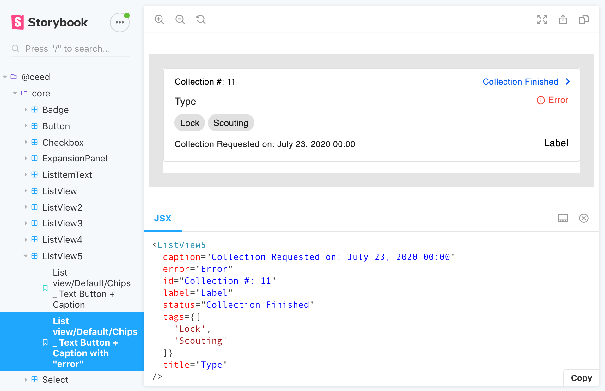
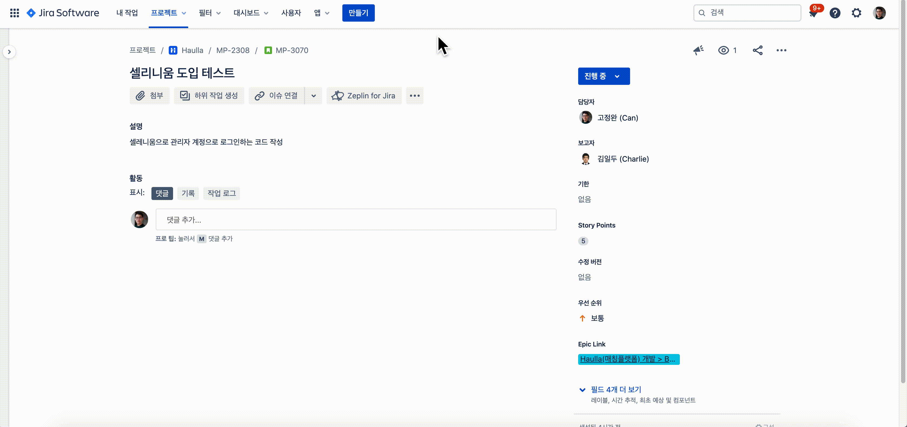
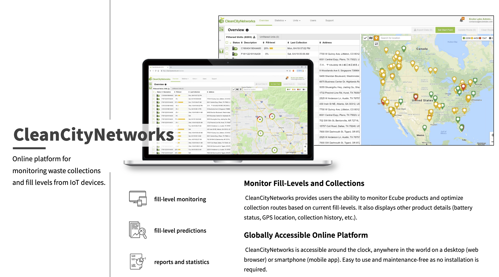

# Ecube Labs Projects Description

[Ecube Labs](https://www.ecubelabs.com)를 다니며 진행했던 프로젝트들의 상세 설명입니다.

- 기간: 2018 - 2020
- [회사 기술 스택](./tech.md)

## 요약

- [ceed/core](#ceedcore) (Storybook)
  - 기간: 2020.09 - 2020.10
- [e2e test](#e2e-test) (Selenium, Appium)
  - 기간: 2020.07 - 2020.08
- [i-Box](#i-Box) (React, Apollo GraphQL)
  - 기간: 2020.01 - 2020.06
- [Haulla Back Office](#haulla-back-office-%EC%9B%B9-%ED%94%84%EB%A1%A0%ED%8A%B8-%EA%B0%9C%EB%B0%9C) (React, Typescript)
  - 기간: 2019.07 - 2019.11
- [CCNx](#ccnx-%EC%9C%A0%EC%A7%80%EB%B3%B4%EC%88%98) (Angular 7)
  - 기간: 2019.06
- [CleanCityNetworks](#cleancitynetworks-ccn-%EC%9C%A0%EC%A7%80%EB%B3%B4%EC%88%98) (Angular JS)
  - 기간: 2019.05
- [CleanScaleNetworks](#cleanscalenetworks-csn-%EA%B0%9C%EB%B0%9C)
  - [대시보드](#partner-scale-api-%EB%8C%80%EC%8B%9C%EB%B3%B4%EB%93%9C-%EA%B0%9C%EB%B0%9C) (Pug, jQuery)
    - 기간: 2019.03 - 2019.04
  - [데이터 시각화](#%EA%B3%84%EA%B7%BC-%EB%8D%B0%EC%9D%B4%ED%84%B0%EB%A5%BC-%EC%95%B5%EA%B7%A4%EB%9F%AC%EB%A1%9C-%EC%8B%9C%EA%B0%81%ED%99%94) (Angular JS)
    - 기간: 2019.01 - 2019.02
  - [Partner Scale API](#partner-scale-api-%EA%B0%9C%EB%B0%9C) (Express)
    - 기간: 2018.10 - 2018.12

## ceed/core

- 기간: 2020.09 - 2020.10
- 설명
  - 회사에서 공통적으로 쓰이는 컴포넌트를 모듈화 해서, npm에 배포했습니다.
- 사용 기술
  - React
  - Typescript
  - Jest
  - Storybook

## e2e test

- 기간: 2020.07 - 2020.08
- 설명
  - e2e 테스트를 위한 환경을 구축하고 테스트 코드를 작성했습니다.
- 사용 기술
  - React, React Native
  - Typescript
  - Jest
  - Selenium
  - Appium
  - wd(Web Driver)
- 기억에 남는 점
  - Animated.View 로 컴포넌트가 감싸져 있을 경우, 컴포넌트에 이벤트를 전달할 때 XPath를 사용해야만 합니다.
  - accessibilityId 로 컴포넌트에 접근하거나, 이벤트를 전달할 경우 IOS 환경에서 의도치 않은 현상이 발생하거나, 반응하지 않는 경우가 많았습니다.
  - 테스트 환경을 구축하더라도, 팀원 모두가 e2e-test 에 관심을 보여주지 않는다면 테스트 자동화가 문화로 정착하기 어렵다는 점을 알게 되었습니다.

## i-Box 웹 프론트 개발

- 기간: 2020.01 - 2020.06
- 설명
  - 이치카와시에 설치된 스마트 공공 쓰레기통입니다.
  - 쓰레기를 누가, 언제, 어디서, 얼마나 버렸는지 추적해서 버린 사람에게 비용을 청구합니다.
  - 웹 혹은 앱을 통해 받은 QR 이미지로, 사용자 인증을 합니다.
  - 이치카와시의 공무원은 i-Box의 기록을 관리자로 모니터링할 수 있습니다.
- 사용 기술
  - React
  - Typescript
  - Redux, redux-observable
  - RxJS, lodash
  - graphql, apollo, apollo-boost, apollo-react-hooks
  - Reactotron
  - intl, react-intl
- 기억에 남는 점
  - 비동기를 커스텀 훅을 사용해 처리해서, 리액트 훅에 대한 이해도가 많이 올라갔습니다.
    - GraphQL API 호출을 모두 커스텀 훅으로 비동기 처리했습니다.
  - 자바스크립트로 바이너리 스트림을 다루는 경험을 해볼 수 있었습니다.
    - QR 이미지를 생성 후 압축해서 업로드하거나 다운받는 작업을 할때, 일반 JSON 텍스트와 달리 바이너리 데이터에 맞게 소켓통신을 해야했습니다.

## Haulla Back Office 웹 프론트 개발

- 기간: 2019.07 - 2019.11
- 제품 소개: <https://www.haulla.com/>
- 설명
  - Haulla 는 쓰레기 수거자(Hauler)와 배출자(Generator)를 연결해주는 매칭 플랫폼입니다.
  - 일반 사용자(Hauler와 Generator)는 모바일 앱을 통해 매칭 서비스를 이용합니다.
  - 관리자(쓰레기 수거 회사)는 Back Office 웹을 통해 쓰레기 수거 서비스의 모니터링 및 관리를 할 수 있습니다.
- 사용 기술
  - React, Next.js
  - Typescript
  - Redux, redux-observable
  - Rxjs, lodash
  - axios, axios-observable
  - Material-UI
- 기억에 남는 점
  - 빈번한 설계의 변경으로 고통받았습니다.
  - 기획이 바뀌는가 하면, 사용할 프레임워크와 라이브러리 또한 자주 바뀌었습니다.
  - 가령 시작할 때는 Next.js를 이용해 만들었는데, 이후 설계가 바뀌어서 바벨과 웹펙 만을 이용한 리액트 프로젝트로 다시 만들어야 했습니다.
  - 신중하고 단단한 설계가 얼마나 중요한지 몸소 느꼈습니다.

## CCNx 유지보수

- 기간: 2019.06
- 제품 소개: <https://www.ecubelabs.com/fleet-management-platform/>
- 설명
  - 앱으로 등록된 쓰레기 수거 차량을 관리하고, 최적화된 경로 안내를 하는 웹 서비스입니다.
- 사용 기술
  - Angular 7
  - Koa
  - Swagger

## CleanCityNetworks (CCN) 유지보수

- 기간: 2019.05
- 제품 소개: <https://www.ecubelabs.com/waste-analytics-platform/>
- 설명
  - 스마트 쓰레기통으로 수집한 데이터를 시각화해서 보여주는 웹 서비스입니다.
- 사용 기술
  - Angular JS

## CleanScaleNetworks (CSN) 개발

- 기간: 2018.10 - 2019.04
- 설명
  - 쓰레기 매립지에서 무게를 측정하는 계근 작업을 자동화, 온라인화 했습니다.
  - CSN 개발 이전에는, 오프라인으로 수집한 계근 데이터가 담긴 USB를 몇개월마다 정부 시청에 물리적으로 전달해야하는 번거로움이 있었습니다.
  - Partner Scale API를 통해 하드웨어로 측정된 계근 데이터를 등록, 수정, 삭제합니다.
  - 대시 보드를 통해 API 사용량을 확인하고, 외부 업체에게 요금을 청구합니다.
  - 회사 서버의 계근 데이터를 시각화하여, CCN 의 추가 기능으로 제공합니다.

### Partner Scale API 대시보드 개발

- 기간: 2019.03 - 2019.04
- 설명
  - Scale API 의 사용량을 시각화한 대시보드 입니다.
  - API 사용량에 따라, 외부 업체에게 금액을 청구하기 위해 쓰였습니다.
  - 기존에 개발된 API 대시보드에, Scale API 사용량이 표시될 수 있도록 기능을 추가했습니다.
- 사용 기술
  - Pug를 통한 SSR
  - jQuery
  - Semantic UI
- 기억에 남는 점
  - 웹 프론트에서는 기술이 정말 순식간에 생겼다가, 인기가 식는다는 점을 느꼈습니다.
  - Pug의 인기가 식은 것처럼, 앵귤러와 리액트도 언젠가 그렇게 되지 않을까라는 생각이 들었습니다.
  - 이때부터 "유행을 타지 않는 기술이란 무엇일까?", "나는 앞으로 무얼 공부해야하나?" 같은 고민을 하게 되었습니다.

### 계근 데이터를 앵귤러로 시각화

- 기간: 2019.01 - 2019.02
- 설명
  - 회사 서버의 계근 데이터를 공무원들이 GUI를 통해 조회할 수 있게끔, 데이터를 시각화 한 프로젝트입니다.
- 사용 기술
  - Angular JS
  - axios
  - Nginx
- 기억에 남는 점
  - 토큰을 통한 로그인과 인증 과정의 설계가, 예상 이상으로 재미있었습니다.

### Partner Scale API 개발

- 기간: 2018.10 - 2018.12
- 링크: <https://doc.cleancitynetworks.com/partner-scale-api-doc/>
- 설명
  - 계근 하드웨어에서 측정된 데이터를 회사 서버에 등록, 수정, 삭제 할 수 있는 API 입니다.
- 사용 기술
  - Express
  - apiDoc
  - MySQL
  - JWT
- 기억에 남는 점
  - JWT를 이용한 외부 인증 방식을 제공했는데, 토큰의 권한을 파싱할때 비트 단위 연산이 사용되어 어려움을 겪었습니다.
  - 하드웨어를 제조하는 파트너사가 퍼센트 인코딩을 지원해 달라고 요청했습니다.
    - 결국 해당 파트너사를 위해 퍼센트 인코딩을 지원하는 미들웨어를 따로 개발해야 했습니다.
