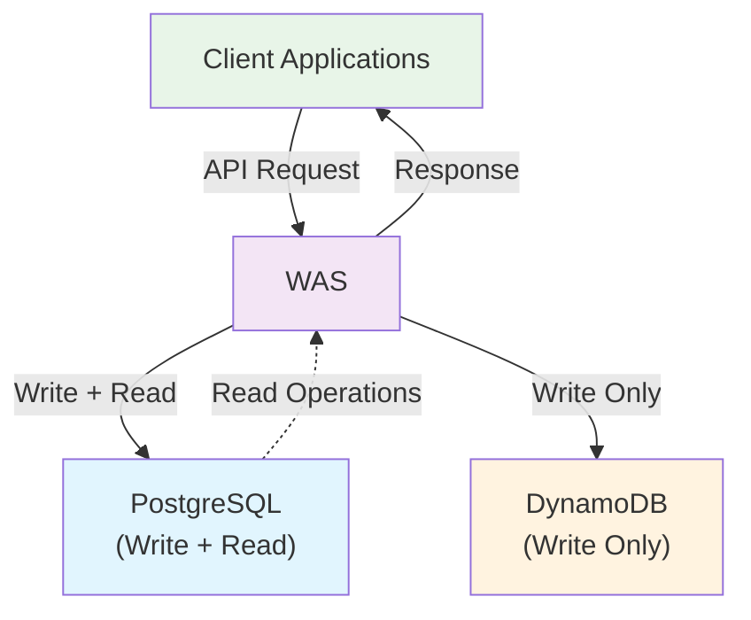
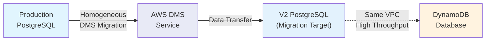
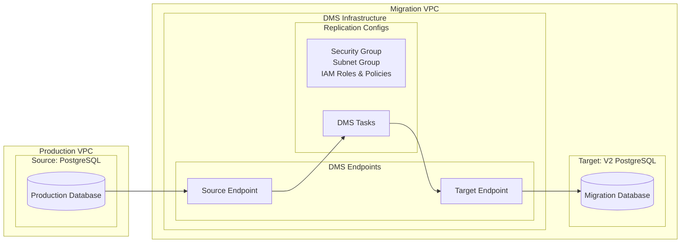
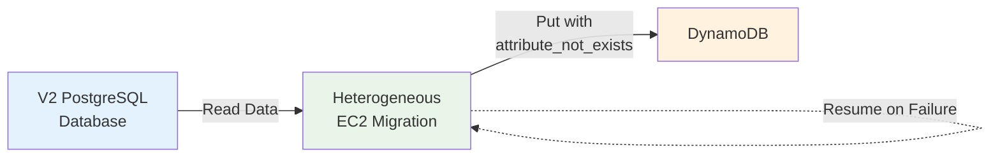
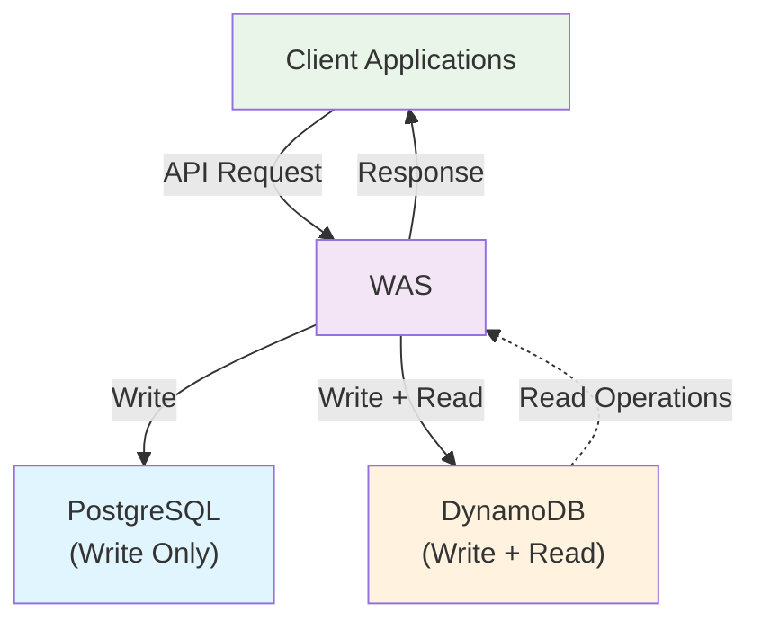
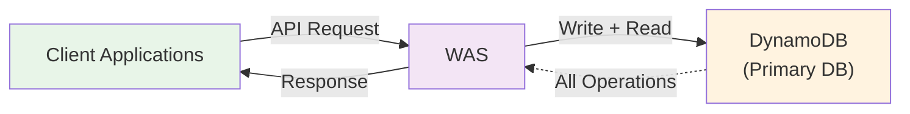
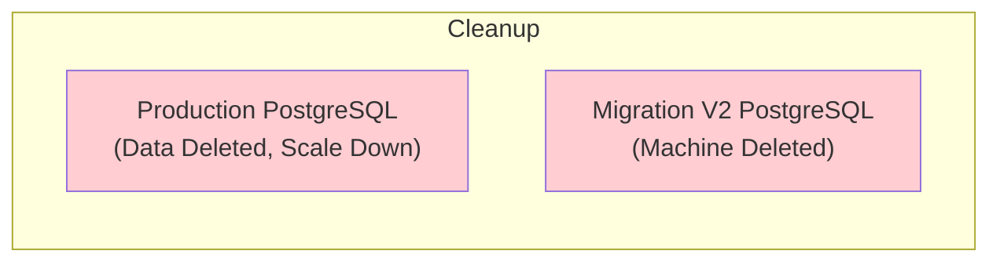
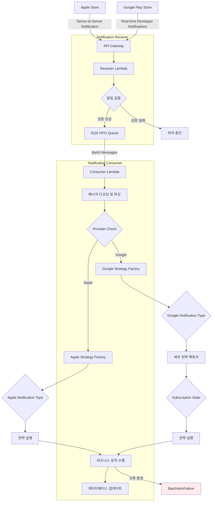

# [SumOne](https://www.monymony.co/) 경력기술

- 1900만 유저, DAU 120만 커플 다이어리 앱
- 근속기간: 2025.05.12 - 2025.08.14
- 사용기술: TypeScript, NestJS, GraphQL, PostgreSQL, DynamoDB
- 주요성과
  - 16억 데이터의 무중단 점진적 마이그레이션 *(2025.05 - 2025.07)*
  - 평생이용권을 월간/연간 구독으로 변경 *(2025.06 - 2025.08)*

## 16억 데이터의 무중단 점진적 마이그레이션

- 기간: 2025.05 - 2025.07
- 사용기술: AWS DMS, PostgreSQL, DynamoDB
- 성과: 핵심 서비스를 PostgreSQL 에서 DynamoDB 로 마이그레이션
- 설명
  - 서비스 **무중단** 마이그레이션
  - 롤백 가능한 **점진적** 마이그레이션
  - 장애를 대비한 **모니터링** 가능한 마이그레이션

### 마이그레이션 절차

#### 절차 1: 양쪽 DB에 데이터 쓰기

- WAS 에서 데이터 쓰기 시 양쪽 DB에 동시 저장
- 데이터 읽기는 PostgreSQL에서만 수행
- 목적: 양쪽에 계속 데이터를 쌓아서 DynamoDB에서 PostgreSQL로 **롤백**이 쉽도록 함

#### 절차 2: AWS DMS를 통한 복제 DB 생성

- AWS DMS를 활용한 Homogeneous 마이그레이션
- DynamoDB와 같은 VPC에 있는 RDS 머신으로 이전
- 목적1: 같은 VPC로 인한 네트워크 throughput 확보
- 목적2: 실서비스 DB와 마이그레이션 DB 머신을 분리해서 실서비스 영향이 없도록 함

#### 절차 3: EC2에서 마이그레이션 프로세스 실행

- AWS DMS Heterogeneous 마이그레이션을 실행
- BatchWrite가 아닌 Put의 attribute_not_exists 옵션을 이용해, 절차1에서 생성된 data가 덮어씌워지지 않도록 함
- resume 기능을 만들어서 마이그레이션 프로세스 중 실패한 item에 대해서 다시 마이그레이션을 이어서 시행할 수 있도록 함
- 목표 속도: 최소 87 Mbps (EC2 micro의 VPC 네트워크 보장 속도)
- Put 성능 최적화를 위해 병렬 프로그래밍

#### 절차 4: DynamoDB 읽기로 전환

- 서버 로직을 수정하여 DynamoDB에서 데이터를 Read
- 롤백을 위해 PostgreSQL과 DynamoDB 양쪽에 데이터를 계속 저장
- 2주간 문제가 없어서 롤백이 필요없다는 판단이 들면, PostgreSQL에 데이터 저장을 중단
- 롤백 전략: PostgreSQL 쓰기를 병행하다가, 문제가 생기면 PostgreSQL을 읽도록 롤백

#### 절차 5: 기존 데이터 DROP

- 절차4까지 성공하면 V2 PostgreSQL RDS 머신과 데이터를 삭제
- 롤백이 필요없어지면 본래 PostgreSQL에서 데이터와 테이블들을 drop
- DynamoDB 단일 데이터베이스로 서비스를 운영하도록 마이그레이션 완료

## 구독 알림 서비스 구현

- 기간: 2025.06 - 2025.08
- 사용기술: TypeScript, NestJS, Prisma, API Gateway, AWS Lambda, SQS
- 성과: Apple 과 Google 의 구독 알림을 처리하는 서버리스 시스템 구축

### 시스템 아키텍처

#### 주요기능

- 알림 수신 및 검증
  - Apple App Store Notification V2 및 Google Play Real-time Developer Notifications 수신
  - JWT 기반 서명 검증을 통한 알림의 무결성 및 신뢰성 보장
- 메시지 큐잉
  - 검증된 알림을 SQS FIFO 큐에 저장하여 안정적인 비동기 처리 보장
- 배치 처리
  - SQS 메시지를 배치 단위로 처리하고, 실패한 메시지에 대한 재시도 지원
- 전략 패턴 기반 확장성
  - Apple/Google의 각 알림 유형 및 상태에 따른 처리 로직을 Strategy Pattern 으로 구현하여 새로운 구독 유형 추가에 유연하게 대응
