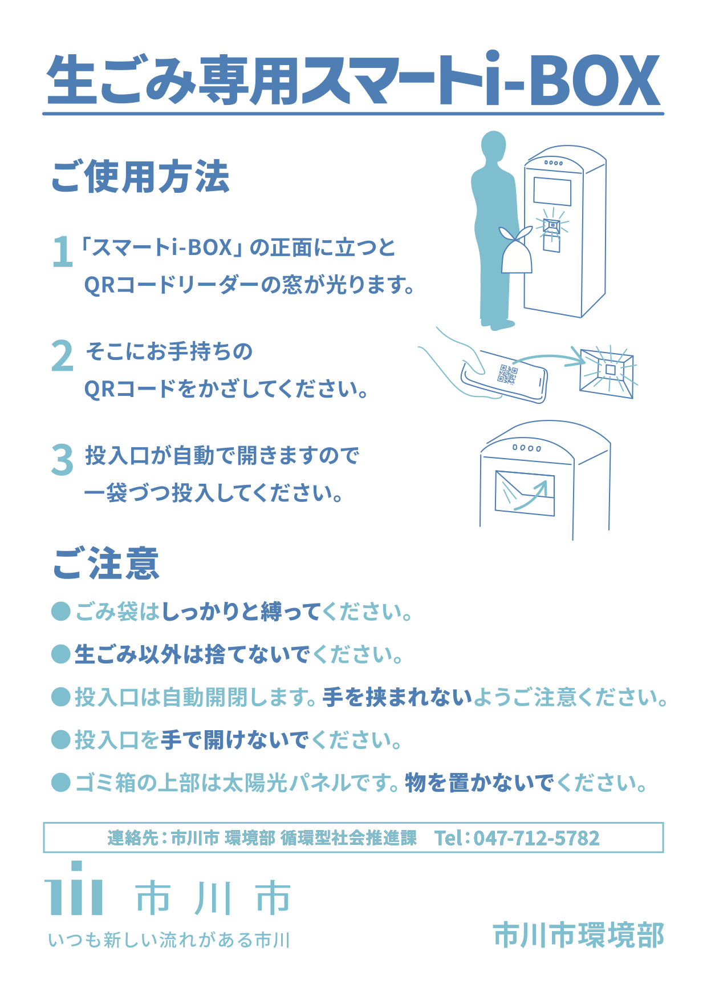
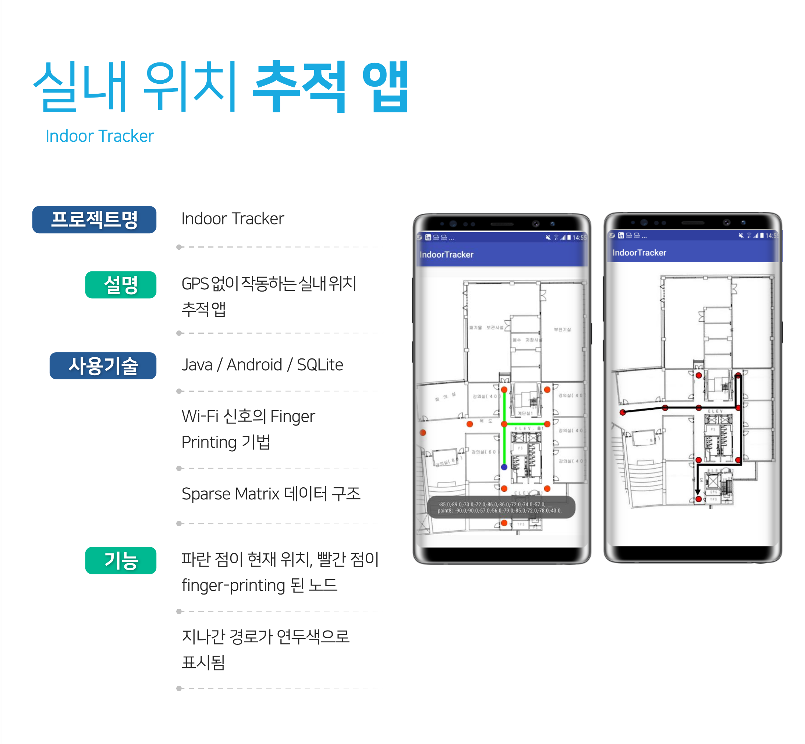
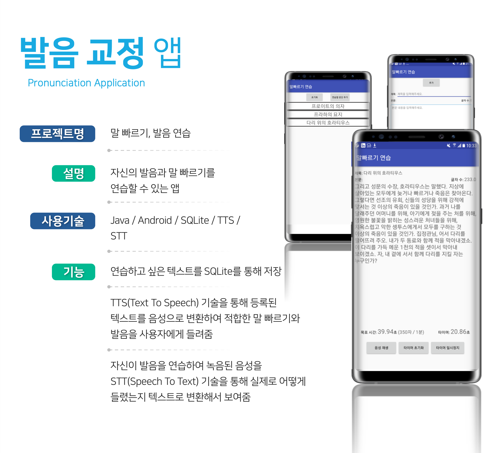

# 이력서

## 1. 기본정보

1. 이름: 고정완
2. 메일 주소: rhwjddhks@gmail.com
3. 전화번호: 010 - 3878- 1459
4. GitHub 주소: https://github.com/ghojeong/resume/blob/master/README.md
<!-- 5. 블로그 주소: (TODO:) -->

 

## 2. 나는 어떤 사람인가? (간단한 자기소개)

2년 동안 React, Typescript 를 이용하여 관리자 대시보드의 웹 프론트 개발을 했습니다. 
코드 리뷰와 Jira/Confluence 를 통한 이슈관리와 문서관리에 익숙합니다. 
최근에는 리눅스의 동작 원리에 관심이 생겨서, 운영체제를 다시 공부하고 있습니다.

 

## 3. 기술적 역량 (기술 스택, 스킬)

- Languages
  - Typescript, ES6, HTML5, CSS3
- Frameworks/ Libraries
  - React, Redux, RxJS
- Databases/ ORM
  - MySql

 

## 4. 경력 사항 (경력 기술서, 프로젝트 등 작성)

 

### 4-1. Appium 으로 e2e test 환경 구축

- 회사(EcubeLabs), 인원(1명), 기간(2020.07 - 2020.08)
- 개발 환경: React, Typescript, Jest, Selenium, Appium, wd(Web Driver)
- 담당업무: 크로스 플랫폼(웹, 안드로이드, iOS) e2e 환경을 selenium 으로 통합하려고 시도
- 배운 점
  - Animated.View 로 컴포넌트가 감싸져 있을 경우, 컴포넌트에 이벤트가 전달되지 않는 경우가 있어서, 결국 XPath를 사용하게 됨
  - 혼자서 테스트 환경을 구축하더라도, 팀이 e2e-test 에 지속적인 관심을 보여주지 않으면 테스트 문화가 정착되지 않음을 깨달음

 

### 4-2. 스마트 쓰레기통 관리자 대시보드 개발

- 회사(EcubeLabs), 인원(2명), 기간(2020.01 - 2020.06)
- 개발 환경: React, Typescript, react-intl
- 담당업무: React 로 모니터링용 관리자 대시보드 개발
- 설명
  - 이치카와시에 설치된 스마트 공공 쓰레기통
  - 누가, 언제, 어디서, 얼마나 버렸는지 기록 후 배출자에게 비용 청구
- 배운 점
  - 비동기를 커스텀 훅을 사용해 처리해서, 리액트 훅에 대한 이해도가 많이 올라감
  - QR 이미지를 업로드하거나 다운받기 위해, 바이너리 소켓통신에 대한 경험을 하게 됨

 

### 4-3. 쓰레기 수거자와 배출자를 연결하는 매칭 플랫폼 개발

- 회사(EcubeLabs), 인원(7명), 기간(2019.07 - 2019.11)
- 개발 환경: React, Typescript, RxJS, redux-observable
- 담당업무: React 로 관리자 대시보드 개발
- 제품 소개: <https://www.haulla.com/>
- 설명
  - 쓰레기 수거자(Hauler)와 배출자(Generator)를 연결해주는 매칭 플랫폼
  - 일반 사용자(Hauler와 Generator)는 모바일 앱을 통해 매칭 서비스를 이용
  - 관리자(쓰레기 수거 회사)는 Back Office 웹을 통해 쓰레기 수거 서비스를 모니터링 및 관리
- 배운 점
  - 충분한 협의와 설계 없이 프로젝트가 진행되어 나중에 전부 갈아엎는 경험을 함
  - 시작할 때는 Next.js로 만들다가, 나중에 바벨과 웹펙 만을 이용한 리액트 프로젝트로 다시 만들게 됨
  - 신중하고 단단한 협의와 설계가 얼마나 중요한지 몸소 느낌

 

### 4-4. 쓰레기 매립지에서 무게를 측정하는 작업을 자동화, 온라인화

- 회사(EcubeLabs), 인원(2명), 기간(2018.10 - 2019.04)
- 개발 환경: Express, Angular JS
- 담당업무
  - 파트너 사에게 제공할 REST API 개발 및 교육
  - API 를 통해 전송된 무게 통계를 웹으로 시각화
- 배운 점
  - JWT를 이용한 외부 인증 방식을 제공했는데, 토큰의 권한을 파싱할 때 비트 단위 연산이 사용되어 적응하는데 어려움을 겪음
  - 하드웨어를 제조하는 파트너사가 퍼센트 인코딩을 지원해 달라고 요청해서, 해당 미들웨어를 추가로 개발하기 위해 야근을 해야했음

 

## 5. 개인 프로젝트

### 5-1. 실내 위치 추적 안드로이드 앱

 

### 5-2. 발음 교정 안드로이드 앱

 

## 6. 기타 활동 (교육, 세미나, 스터디, 출판, 오픈소스...)

 

 

### 6-1. 교육

- [리얼리눅스](https://reallinux.co.kr/) 리눅스 SW 기본기 수료, 기간(2020.9.7 - 2020.11.30)
- [NextStep](https://edu.nextstep.camp/) TDD, Clean Code with Java 10기 수료, 기간(2020.10.26 - 2020.12.23)

 

### 6-2. 한빛미디어 후원의 유료 세미나에서 발표

- 기간: 2019.03 - 2019.06
- 링크: <https://www.onoffmix.com/event/183044>
- 설명
  - 본인이 직접 기획하고, 준비하고, 발표자로 참가
  - 본인이 2개의 세션을 발표
  - 1만 1천원을 지불한 사람들이 80명 넘게 강의장을 꽉 채움

 

## 7. 학력&자격증

- [2020 오픈소스 컨트리뷰톤](https://github.com/ghojeong/competition/blob/master/oss/README.md) 특별상 수상
- [구글 Hash Code 2020](https://github.com/ghojeong/competition/blob/master/hashcodejudge/README.md) 3232/10724 월드 랭킹
- UNIST: 2013.03 - 2018.08
