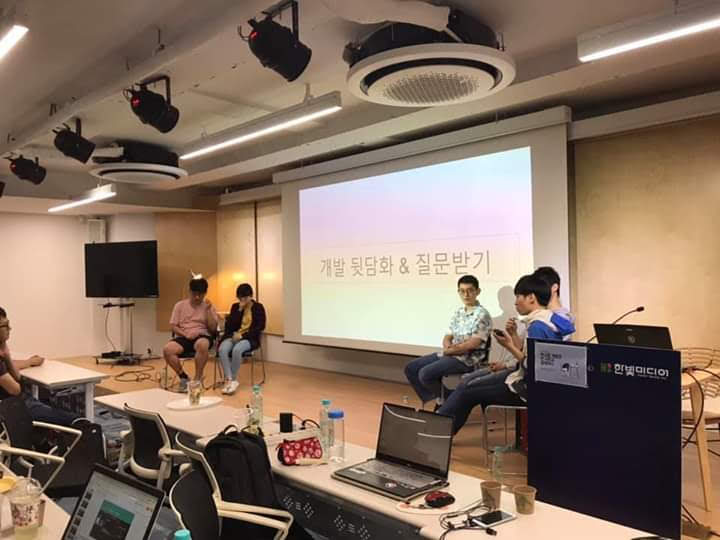

# 대외활동

## 커뮤니티

### NEXTSTEP 리뷰어 활동

- 기간: 2021-03 - 2021-05
- 링크: <https://edu.nextstep.camp/s/ApJ4Ca71>
- 설명
  - TDD, Clean Code with Java 11기 교육과정에서 리뷰어로 일했습니다.
  - 코드스쿼드 부트캠프를 풀타임으로 참여하며 리뷰어 활동을 했기에, 개발 업무와 리뷰를 병행할 수 있다는 자신감을 얻었습니다.
  - 코드량이 많아질수록 리뷰하는 시간이 기하급수적으로 증가한다는 점을 깨닫고, 작업단위를 이슈로 잘게 쪼개서 피드백을 주고받는 딜레이를 짧게 만들어야할 필요성을 느꼈습니다.

### 오픈소스 컨트리뷰톤 수상

- 기간: 2020.08 - 2020.09
- 링크: <https://www.oss.kr/contributhon_project/show/e06eb6b5-25d9-4be4-92ea-c24ceda137b0>
- 설명: 정보통신산업진흥원에서 주최하는 오픈소스 컨트리뷰톤 행사에 참가하여 특별상을 수상했습니다.

### 공감 세미나 주니어

- 기간: 2019.03 - 2019.06
- 링크: <http://www.hanbit.co.kr/store/education/edu_view.html?p_code=S3414110334>
- 설명
  - 한빛미디어 후원으로 열었던 유료 세미나입니다.
  - 본인이 직접 기획하고, 준비하고, 발표자로 참가했습니다.
  - 본인이 2개의 세션을 발표했습니다.
    - 첫번째 세션: 개발자가 되고 싶은 대학생 및 성인을 대상으로, 주니어로서 겪었던 어려움을 이야기했습니다.
    - 두번째 세션: 개발자로 취업을 희망하는 친구들과 2개월 간 만든 미니 프로젝트를 발표했습니다.
- 기억에 남는 점
  - 1만 1천원을 지불한 사람들이 80명 넘게 강의장을 꽉 채웠습니다.
  - 준비를 할 때도 긴장했지만, 발표를 할 때는 더욱 긴장해서 다리에 힘이 들어가지 않아 중간중간 의자에 앉아야 했습니다.
  - 발표가 끝나고 나서, 제가 기대했던 것 이상의 박수 소리에 기뻐서 몸을 떨었던게 기억납니다.
  - 행사가 끝나고 긴장이 풀리자, 화장실로 가서 헛구역질 했던게 기억납니다.
  - 이때부터 커뮤니티 활동이라는 스릴에 중독이 된 것 같습니다.

## 스터디

### 위스덤마인드 데이터모델링 이론 스터디

- 기간: 2023.12 - 2024.01
- 설명: "김기창의 데이터 모델링 강의" 책을 완독했습니다.

### 이펙티브 자바 2차 스터디

- 기간: 2021.07 - 2021.10
- 링크: <https://github.com/ghojeong/Effective-Java-Study>
- 설명: 이펙티브 자바를 스터디를 통해 2회 완독 했습니다.

### 이펙티브 자바 1차 스터디

- 기간: 2021.01 - 2021.04
- 링크: <https://github.com/java-squid/effective-java>
- 설명: 이펙티브 자바를 스터디를 통해 1회 완독 했습니다.

### 디자인 패턴 스터디

- 기간: 2020.04 - 2020.10
- 링크: <https://github.com/ghojeong/GoF>
- 설명: GoF의 디자인 패턴을 반년동안 꾸준히 공부했습니다.

### <모던 자바스크립트 입문> 책 스터디

- 기간: 2019.07 - 2019.09
- 링크: <https://github.com/study-records/modern-javascript-study/tree/master/Modern_Javascript_Primer>
- 설명
  - 자바스크립트에 대한 이해도를 높이고 싶어서 시작한 스터디입니다.
  - 공부했던 내용을 문서로 정리해서 GitHub 에 올렸습니다.
- 기억에 남는 점
  - 자바를 본업으로 삼고 계시는 경력직 개발자분들도, 언제나 새로운 학습에 목말라 있다는 열정이 참 대단하다고 느꼈습니다.
