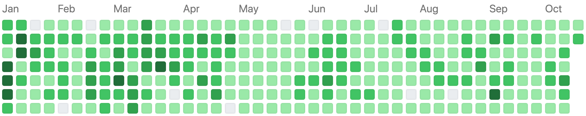
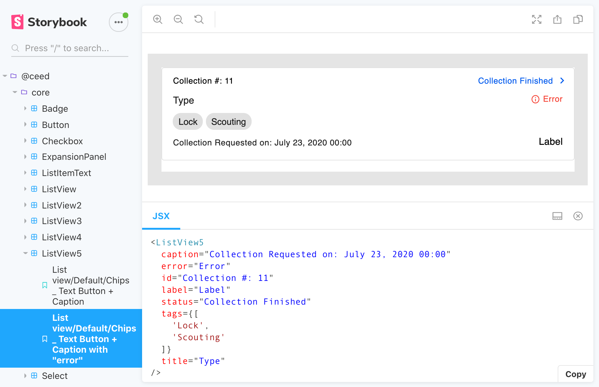
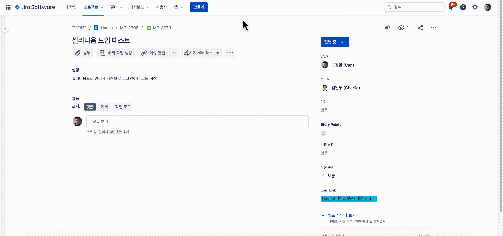
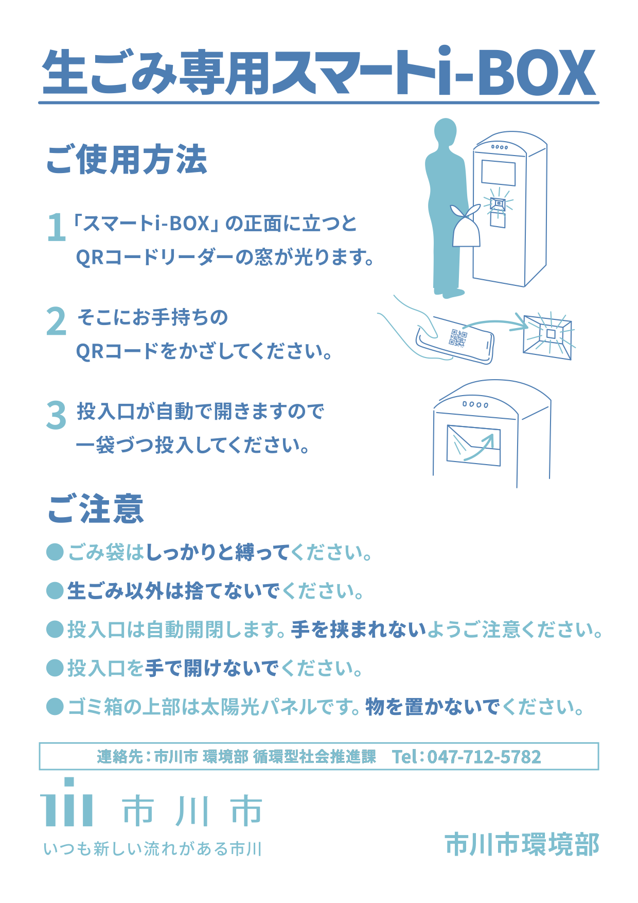

# 고정완 / JeongWan Gho

- 나이: 1994년생, 27살
- 거주지: 코엑스 근처

## 가치관

- 정숙하고 외로운 독서실보다는, 활기찬 파티룸을 좋아합니다.
- 폭풍 같은 브레인스토밍이 깨끗한 코드 혹은 문서로 완성될 때 희열을 느낍니다.
- 기술적으로 소외당하는 분야에서, 새로운 기술 서비스 시장을 찾아낼 수 있다고 믿습니다.
- [책을 좋아합니다.](./book/README.md)
- [**커뮤니티 활동을 좋아합니다.**](./community/README.md)

## 이력

- [Ecube Labs](./ecubelabs/README.md): 2018.10 - 재직 중
  - 기술 스택: React, Typescript
- [UNIST](./unist/README.md): 2013.03 - 2018.09
  - [성적표](./unist/grade.pdf)

## 경험 프로젝트

### ceed/core 컴포넌트 라이브러리 모듈화

- 기간: 2020.09
- 사용 기술: React, Typescript, Storybook
- 설명
  - 회사에서 공통적으로 쓰이는 스타일드 컴포넌트를 모듈화 해서, npm에 배포

### e2e test 환경 구축

- 기간: 2020.07 - 2020.08
- 사용 기술: React, Typescript, Jest, Selenium, Appium, wd(Web Driver)
- 설명
  - e2e 테스트를 위한 환경을 구축하고 테스트 코드를 작성

### i-Box 관리자 웹페이지 개발

- 기간: 2020.01 - 2020.06
- 사용 기술: React, Typescript, react-intl
- 설명
  - 이치카와시에 설치된 스마트 공공 쓰레기통
  - 누가, 언제, 어디서, 얼마나 버렸는지 기록 후 배출자에게 비용 청구
  - 관리자 웹페이지로 모니터링 가능

|||

### Haulla 웹 프론트 개발

- 기간: 2019.07 - 2019.11
- 사용 기술: React, Typescript, redux-observable
- 제품 소개: <https://www.haulla.com/>
- 설명
  - Haulla: 쓰레기 수거자(Hauler)와 배출자(Generator)를 연결해주는 매칭 플랫폼
  - 일반 사용자(Hauler와 Generator)는 모바일 앱을 통해 매칭 서비스를 이용
  - 관리자(쓰레기 수거 회사)는 Back Office 웹을 통해 쓰레기 수거 서비스를 모니터링 및 관리

### CleanScaleNetworks (CSN) 개발

- 기간: 2018.10 - 2019.04
- 사용 기술: Express, Angular JS
- 설명
  - 쓰레기 매립지에서 무게를 측정하는 계근 작업을 자동화, 온라인화
  - Rest API 와 데이터 시각화 양쪽을 구현

