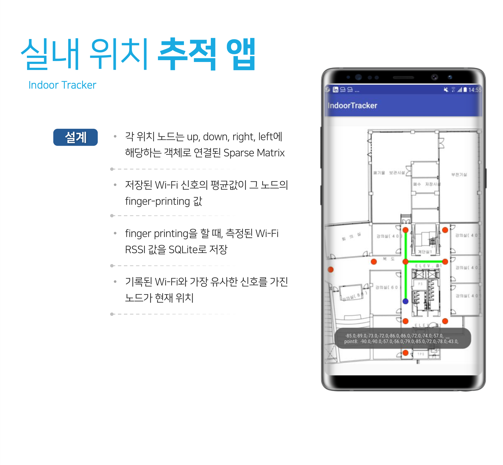
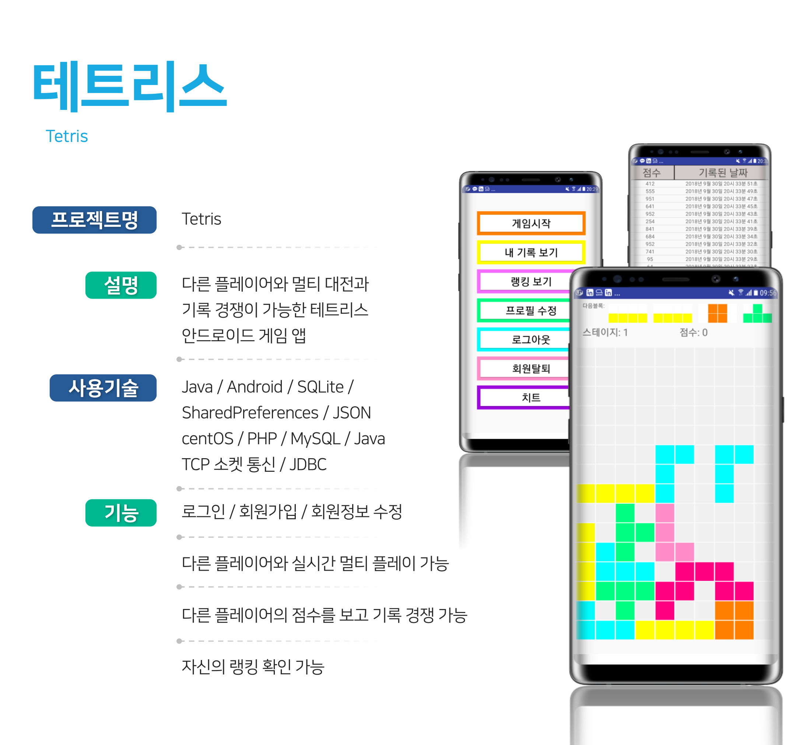
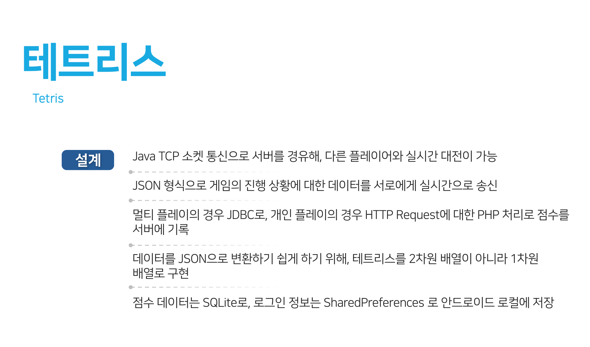
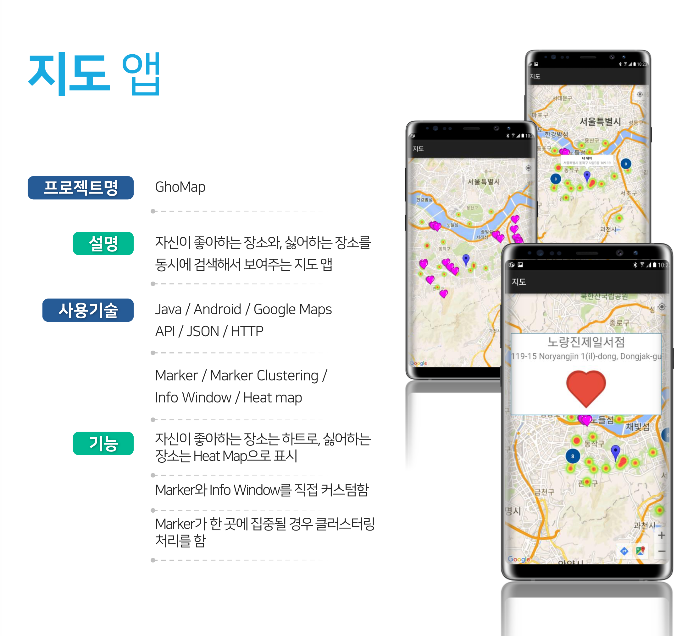

# UNIST Projects Description

[UNIST](https://www.unist.ac.kr)를 재학하며 진행했던 프로젝트들의 상세 설명입니다.

- 프로젝트 진행 기간: 2017.03 - 2018.09

## 요약

- 팀 프로젝트
  - [Class Mate](./classmate.md) (영상 스트리밍 앱)
- 개인 프로젝트
  - [Indoor Tracker](https://github.com/ghojeong/resume/blob/master/unist/README.md#indoor-tracker) (실내 위치 추적 앱)
  - [Web Server](https://github.com/ghojeong/resume/blob/master/unist/README.md#web-server) (바닥부터 C 언어로 구현한 웹서버)
  - [고-Shop](https://github.com/ghojeong/resume/blob/master/unist/README.md#%EA%B3%A0-shop) (쇼핑몰)
  - [Tetris](https://github.com/ghojeong/resume/blob/master/unist/README.md#tetris) (멀티 플레이가 가능한 게임 앱)
  - [Pronunciation App](https://github.com/ghojeong/resume/blob/master/unist/README.md#pronunciation-app) (TSS와 STT를 활용한 발음 교정 앱)
  - [Gho Map](https://github.com/ghojeong/resume/blob/master/unist/README.md#gho-map) (구글 지도를 활용한 앱)

## [ClassMate](./classmate.md)

[**YouTube**](https://youtu.be/RMkTWNjY1Vc)

[Source Code](https://github.com/JVHE/ClassMate)

스마트폰 카메라 및 스크린을 방송하는 앱입니다. 자세한 내용은 [링크](./classmate.md)를 확인해주세요.

## Indoor Tracker

교수님의 의뢰로 만든 개인 프로젝트입니다. GPS의 기능 없이 실내에서 자신이 어디에 있는지 알려주는 안드로이드 앱입니다. Wi-Fi 신호의 Finger Printing 기법을 이용했으며, Finger Printing 된 노드들을 Sparse Matrix 자료구조 형태로 연결했습니다. Finger Printing을 하기 위해서 각 노드에서 수집된 Wi-Fi 신호들을 로컬 데이터베이스에 SQLite를 통하여 저장했습니다. 각 노드의 Finger Printing 값과 현재 측정된 Wi-Fi 신호 값을 상대적으로 비교하여, 자신의 현재 위치를 실시간으로 알아냅니다. 현재 위치에서 이동할 경우, 변경된 위치와 이동 경로를 새롭게 표시해줍니다. 이동 경로가 벽을 통과하거나, 존재하지 않는 길을 지나가지 않도록 예외처리를 하였습니다.

## Web Server

HTTP Request와 Response를 공부하기 위해 만든 개인 프로젝트입니다. C언어로 소켓 프로그래밍을 하여 밑바닥부터 만든 간단한 웹서버입니다. 브라우저의 HTTP Request에 맞추어 적절한 형식으로 HTML, CSS, JavaScript, 이미지 파일에 대한 데이터를 다시 브라우저에게 Response 해줍니다. 다수의 클라이언트 요청을 PThread를 사용한 멀티 스레드로 처리했습니다. 개발은 우분투 서버의 터미널에서 vim, gcc, gdb를 이용해 코딩했습니다.

## 고-Shop

웹 개발을 익히기 위해 만든 개인 프로젝트입니다. 서버에 centOS, Apache, MariaDB, php를 직접 소스 설치한 후, HTML, php, JavaScript, CSS 파일을 만들었습니다. 로그인, 회원가입, 회원정보 수정, 장바구니 기능이 있으며 관리자 모드와 유저 모드가 있습니다. 관리자 아이디로 로그인할 경우 관리자 모드가 되며, 상품과 유저를 관리할 수 있는 기능이 추가됩니다. 상품 목록은 페이징 처리가 되어있으며, 상품을 검색, 분류, 정렬하더라도 페이징 처리가 유지되도록 했습니다.

## Tetris

테트리스 게임이 재밌어서 만든 개인 프로젝트입니다. 다른 플레이어와 멀티 플레이와 기록 경쟁이 가능한 안드로이드 게임 앱입니다. 로그인, 회원가입, 회원정보 수정이 가능하며, 로그인 정보는 SharedPreference로 저장되고, 게임의 기록은 로컬 데이터베이스에 SQLite를 통해 저장됩니다. 회원 정보와 게임 기록은 서버에 HTTP Request로 전송되어 저장됩니다. 백엔드 서버는 centOS, Apache, MySQL, php로 구축했습니다. 멀티 플레이시에는 자신의 게임 상태가 다른 플레이어에게 Java의 TCP 소켓 통신으로 서버를 경유해 실시간으로 전송됩니다. 매초마다 실시간으로 전송되는 데이터는 JSON 형식으로 보냈습니다.

## Pronunciation App

스스로 발음과 말 빠르기를 교정하기 위해 만든 개인 프로젝트입니다. 안드로이드 앱이며, 자신이 연습하고 싶은 텍스트를 로컬 데이터베이스에 SQLite를 통해 저장할 수 있습니다. TTS(Text To Speech) 기술로 등록된 텍스트를 음성으로 변환하여, 사용자는 자신이 목표로 해야 할 적절한 발음과 말 빠르기를 들을 수 있습니다. 또한 STT(Speech To Text) 기술로 녹음된 음성을 텍스트로 변환하여, 사용자의 발성이 실제로는 어떻게 들렸는지 텍스트로 직접 보여줍니다.

## Gho Map

다른 안드로이드 지도 앱에서 한가지 검색 결과만이 뜨는 것이 아쉬워 만든 개인 프로젝트입니다. 자신이 좋아하는 장소와, 싫어하는 장소 두 가지를 동시에 검색하여 결과를 보여주는 안드로이드 앱입니다. 구글 MAPS API를 사용했으며, JSON과 HTTP를 통해 검색을 요청하고 검색 결과를 받았습니다. Marker와 Info Window를 직접 커스텀하여 자신이 좋아하는 장소는 하트로, 싫어하는 장소는 Heat Map으로 나타나게 했습니다. 한 곳에 집중된 Marker에 대해 마커 클러스터링 처리를 하였습니다.

