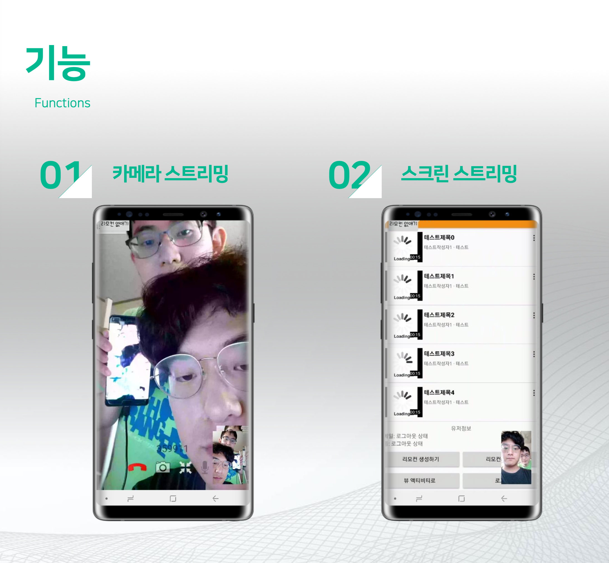
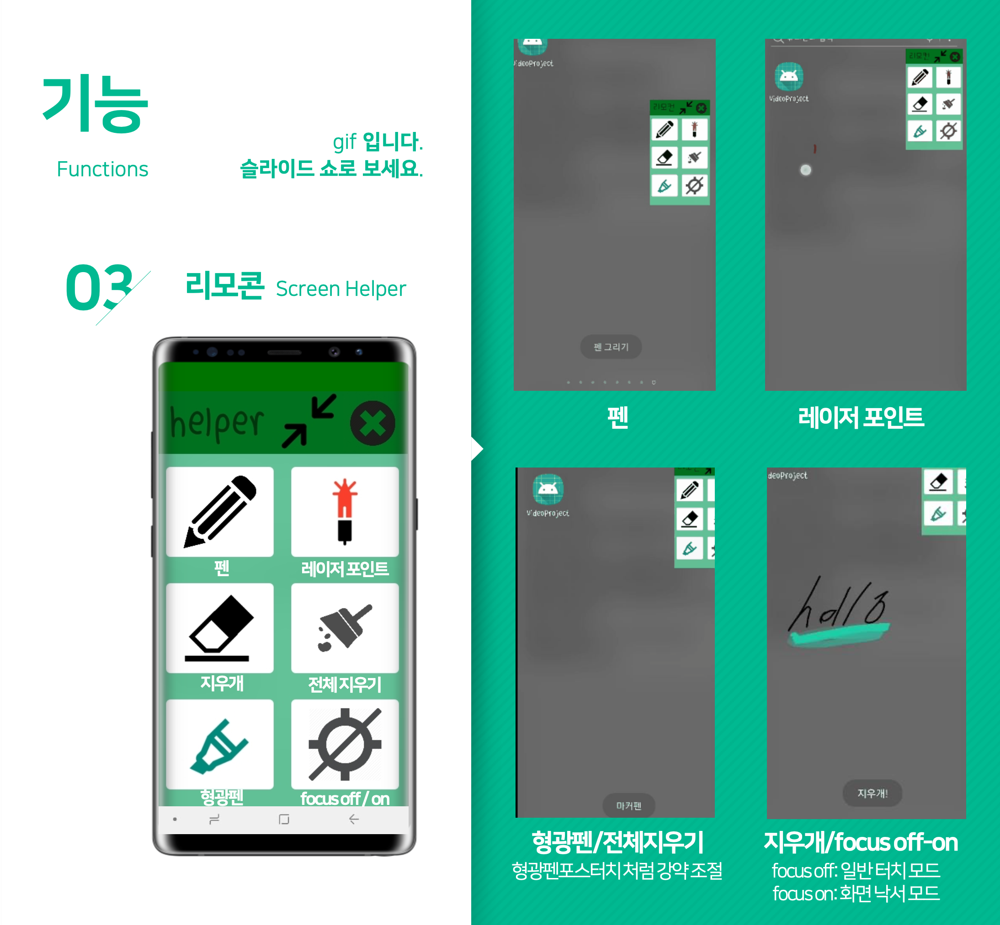
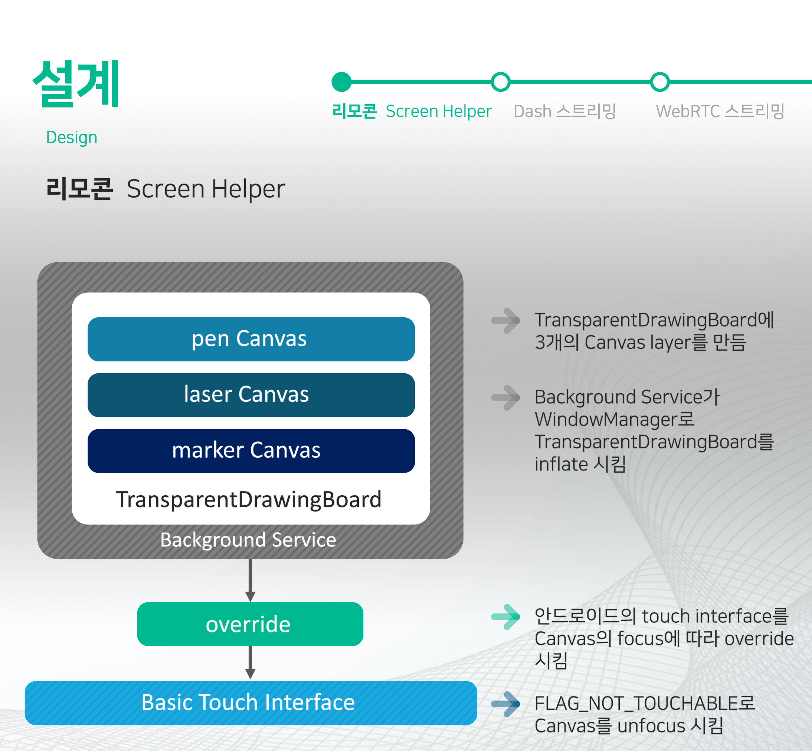
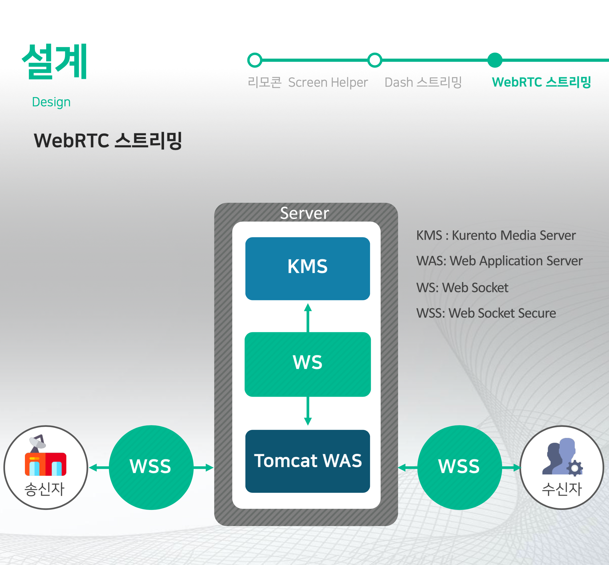
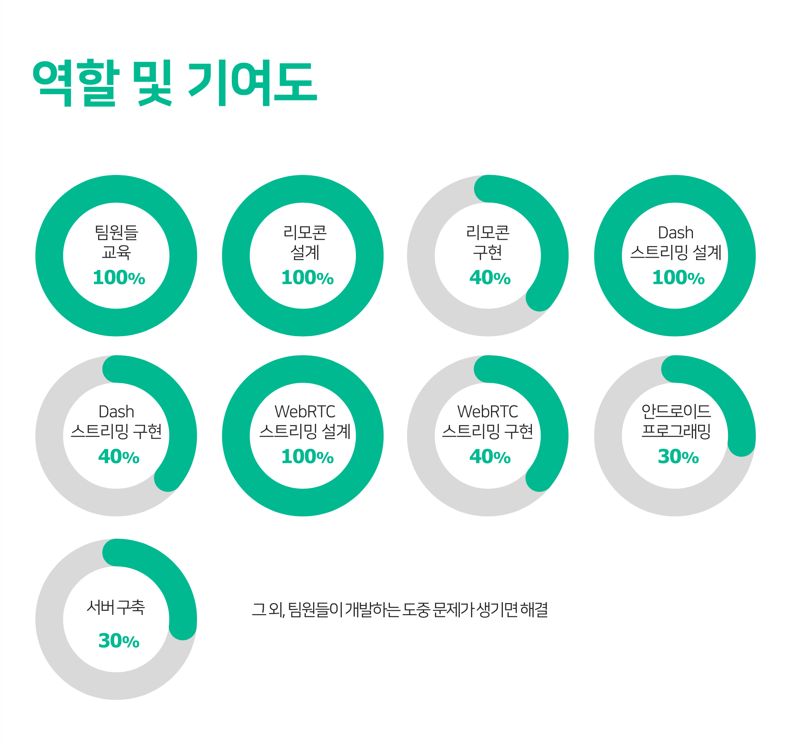

# ClassMate

[**YouTube**](https://youtu.be/RMkTWNjY1Vc)

[Source Code](https://github.com/JVHE/ClassMate)

교수님께서 애플 펜슬로 빔프로젝터에 연결된 아이패드를 칠판 대신 사용하며 수업하는 것을 보고, 안드로이드에서도 같은 방식으로 과외방송을 할 수 있도록 하고 싶은 마음에 시작한 팀 프로젝트입니다. 스마트 폰의 카메라 혹은 스크린을 실시간으로 방송하고, 방송되고 있는 화면 위에 방송자가 펜으로 수업을 할 수 있는 안드로이드 앱입니다. 우분투 서버에서 Java, php, JavaScript, Perl을 통해 개발했으며 HTTP, WebRTC, Mpeg-DASH 프로토콜을 사용했습니다. 주요 기능으로 Adaptive Streaming을 실현해, 네트워크 환경에 따라 동영상의 bitrate가 변할 수 있도록 했습니다.

저는 이 프로젝트에서 설계와 개발, 그리고 역할 분배를 해주는 역할을 맡았습니다. 저는 프로젝트를 진행하며 팀원들이 자유롭게 의견을 교류할 수 있도록 노력했습니다. 매주 두 번씩 정기적으로 회의를 할 때마다 사회자와 서기를 자처하여 회의한 내용을 기록했으며, 팀원들이 방향을 잃을 때마다 진행 상황을 정리하고 요약해 다음 단계로 나아갈 수 있도록 발판을 마련했습니다. WebRTC와 DASH 프로토콜을 팀원들이 구현할 수 있도록 관련 논문들과 기술문서들을 읽고 정리해, 팀원들에게 제공했습니다. 또한, 팀원들이 개발하는 도중 문제가 생기면 그에 대한 해결책을 제시해 진행이 늦춰지는 상황을 막았습니다.

제가 팀 프로젝트를 하며 겪은 가장 큰 어려움은, 팀원들의 사기와 단결력을 유지하는 일이었습니다. 팀원들과 같이 시도한 공부량과 작업량은 결코 적은 양이 아니었습니다. 팀원들이 계속 시간을 성실하게 쓰도록 하기 위해서는, 팀원들에게 자신이 하는 일의 가치를 스스로 대단하게 느끼게끔 해야 했습니다. 저는 팀원들이 큰 꿈을 갖고 행동할 수 있도록, 여러 IT 기업들의 성장과 성공 사례들을 매주 있는 회의 시간에 들려주었습니다. 하나의 꿈과 목표라는 열정을 갖고, 그 불길이 꺼지지 않도록 계속 관리하는 일은 무척 힘들었지만, 저에게 잊을 수 없는 기억을 많이 남겼습니다.

